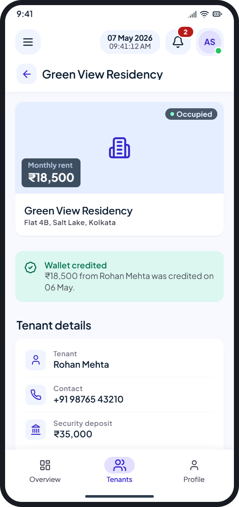
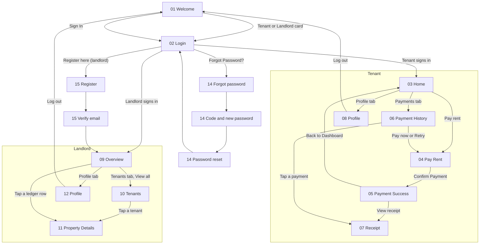

<p align="center">
  
</p>

<h1 align="center">RentFlow for Android</h1>

<p align="center">
  A rent app for tenants and landlords. Tenants pay rent and keep receipts; landlords track collections, tenants and properties.<br>
  Built with Kotlin and Jetpack Compose, and designed to match the RentFlow web app’s phone layout.
</p>

> **Status:** every screen is built, but the app runs on **demo data**. No backend API is connected yet (see [What’s next](#whats-next)).

## Contents

- [Screens](#screens)
- [App flow](#app-flow)
- [Try it with demo data](#try-it-with-demo-data)
- [Design system](#design-system)
- [Tech stack](#tech-stack)
- [Project structure](#project-structure)
- [Build and run](#build-and-run)
- [What’s next](#whats-next)
- [Credits and licences](#credits-and-licences)

## Screens

The screenshots are rendered from the approved design mockups the app was built from. The numbers match the screen numbers used during design review.

### Welcome and sign-in

| 01 Welcome | 02 Login: Tenant | 02 Login: Landlord | 02 Login: One-time code |
|:---:|:---:|:---:|:---:|
|  |  |  |  |
| Pick Tenant or Landlord, or tap Sign In. | One login for both roles. Email and password, with “Remember for 30 days”. | The switch changes the headline, subtitle and the “Register here” link. | “Login with OTP instead” emails a 6-digit code. Resend unlocks after 60 seconds. |

### Forgot password and registration

| 14 Forgot password | 14 New password | 14 Done | 15 Register (landlord) | 15 Verify email |
|:---:|:---:|:---:|:---:|:---:|
|  |  |  |  |  |
| Sends a reset code for the role chosen on login. | Code, new password and confirmation, with the password rule. | Confirms the reset and returns to login. | Only landlords sign up; they add their tenants later. Phone has a fixed +91. | Six code boxes. The button unlocks once all six digits are in. |

### Tenant

| 03 Home | 04 Pay Rent | 05 Payment Success |
|:---:|:---:|:---:|
|  |  |  |
| This month’s rent with a Pay rent button, quick actions, lease tiles, alerts and recent payments. | Rent details, payment method and summary. Confirm sits in a bottom sheet. | Confirmation with the transaction details. Links to the receipt. |

| 06 Payment History | 07 Receipt | 08 Profile |
|:---:|:---:|:---:|
|  |  |  |
| Year summary, counts and every payment, filtered by All, Paid, Pending or Failed. Pending and failed rows can be paid or retried. | One receipt card with the transaction and wallet status. | Personal, rent and wallet details, and Log out. |

### Landlord

| 09 Overview | 10 Tenants | 11 Property Details | 12 Profile |
|:---:|:---:|:---:|:---:|
|  |  |  |  |
| Month’s collections, quick actions, portfolio health, tenants who need attention, and a payment ledger with filters. | Search and filter tenants. Each card shows rent, due or paid date and phone. | Rent, occupancy, wallet status, tenant and lease details. Call or remind the tenant. | Owner details, portfolio numbers, bank account and Log out. |

## App flow



How navigation works:

- **Bottom tabs.** Tenants have Home, Payments and Profile. Landlords have Overview, Tenants and Profile.
- **Top bar.** The menu button opens a side drawer with the same tabs and Log out. The bell lists alerts. The avatar opens Profile. Inner screens show a back arrow and the screen title.
- **Back button.** Inner screens go back to where they were opened from. On a home screen (Tenant Home, Landlord Overview or Welcome), Back leaves the app.
- **Paying rent.** After Confirm Payment, that month shows as Paid on Home and in Payment History for the rest of the session. Log out resets the demo data.

## Try it with demo data

There is no server yet, so sign-in accepts any valid details:

1. On Welcome, pick **Tenant** or **Landlord**.
2. Enter **any valid email** and **any password**, then tap **Sign In to Dashboard**.
   - Or tap **Login with OTP instead**, then **Send code**, and enter **any 6 digits**.
3. Registration and Forgot Password check the form the same way. A new password needs 8+ characters with upper and lower case, a number and a symbol.

Tenant demo data: Rohan Mehta, Green View Residency, rent ₹18,500 due on the 10th. Landlord demo data: Amit Sharma, 5 properties and 5 tenants, of whom 2 have May rent pending.

## Design system

The app copies the phone design of the RentFlow web app (`rent-management-ui`), so both look the same.

**Colours.** One primary colour for both roles, from the web’s Material 3 tokens ([`Color.kt`](app/src/main/java/com/thebackendguy/myandroidtestapp/ui/theme/Color.kt)):

| Role | Hex | | Role | Hex |
|---|---|---|---|---|
| Primary | `#3525CD` | | Surface | `#F8F9FF` |
| Primary container | `#4F46E5` | | Surface container low | `#EFF4FF` |
| Primary fixed | `#E2DFFF` | | Surface container | `#E5EEFF` |
| Secondary (success) | `#006C4A` | | On surface | `#0B1C30` |
| Secondary container | `#82F5C1` | | On surface variant | `#464555` |
| Error | `#BA1A1A` | | Inverse surface (dark cards) | `#213145` |

**Type.** Plus Jakarta Sans, with the web’s phone type scale ([`Type.kt`](app/src/main/java/com/thebackendguy/myandroidtestapp/ui/theme/Type.kt)):

| Style | Size / line height | Weight | Used for |
|---|---|---|---|
| Metric | 32 / 38 | Bold | Big amounts (₹18,500) |
| Headline large | 28 / 36 | Bold | Login and auth headlines |
| Headline medium | 22 / 28 | SemiBold | App name next to the logo |
| Headline small | 18 / 24 | SemiBold | Section titles, top bar title |
| Body large / medium / small | 16 / 14 / 13 | Regular | Text |
| Label medium / small | 13 / 11 | SemiBold | Buttons, chips, captions |

**Icons.** Lucide v0.488, the same set and version as the web. They’re generated into [`Lucide.kt`](app/src/main/java/com/thebackendguy/myandroidtestapp/ui/icons/Lucide.kt) from the web project’s icon data.

**Logo.** The web Home page logo: a `#4F46E5` tile with a white Lucide “Home” icon. It is also the adaptive launcher icon ([`ic_launcher_foreground.xml`](app/src/main/res/drawable/ic_launcher_foreground.xml)).

**Components.** Cards with 12 dp corners and a soft shadow, dark summary cards, pill-shaped filters with a sliding thumb, quick-action chips that scroll sideways, and a bottom bar with the Material 3 pill indicator. Buttons shrink slightly when pressed instead of showing a ripple, as on the web.

## Tech stack

| | |
|---|---|
| Language | Kotlin 2.2 |
| UI | Jetpack Compose (BOM 2024.09), Material 3 |
| Android | minSdk 28, targetSdk and compileSdk 36 |
| Build | Android Gradle Plugin 9.3, Gradle version catalog |
| Navigation | A screen enum with Compose state, no navigation library |
| Data | [`DemoData.kt`](app/src/main/java/com/thebackendguy/myandroidtestapp/data/DemoData.kt) for now |

## Project structure

```
app/src/main/
├── java/com/thebackendguy/myandroidtestapp/
│   ├── MainActivity.kt          # Screen enum, navigation, back handling, drawer, session state
│   ├── data/
│   │   └── DemoData.kt          # Demo tenants, payments, amounts; ₹ formatting
│   └── ui/
│       ├── theme/               # Color.kt, Type.kt, Theme.kt
│       ├── icons/               # Lucide.kt (generated), LucideIcon.kt
│       ├── components/          # Cards, buttons, fields, controls, top bar, bottom nav, page frames
│       └── screens/
│           ├── Shell.kt         # Top bar and tabs per role, profile header, log out button
│           ├── auth/            # Welcome, Login, Forgot Password, Register
│           ├── tenant/          # Home, Pay Rent, Payment Success, History, Receipt, Profile
│           └── landlord/        # Overview, Tenants, Property Details, Profile
├── res/
│   ├── font/plus_jakarta_sans.ttf
│   ├── drawable/                # Launcher icon layers
│   └── values/                  # App name, colours, window theme
└── assets/licenses/OFL-PlusJakartaSans.txt
```

## Build and run

1. Open the project in Android Studio.
2. Let Gradle sync, then run the **app** configuration on a device or emulator (Android 9 or newer).

From the command line:

```bash
./gradlew assembleDebug
```

On Windows use `gradlew.bat assembleDebug`. The APK is written to `app/build/outputs/apk/debug/app-debug.apk`.

## What’s next

The app will connect to the same backend as the web app (`rent-management`, Express and MongoDB, base path `/api/v1`). Planned order:

1. **Sign-in:** login with password or code, forgot password, registration, log out and remembering the session. These APIs already exist.
2. **Landlord data:** tenants, properties and leases for Tenants, Property Details, Overview and Profile. These APIs already exist.
3. **Tenant rent screens:** these need backend work first. Payments must be limited to the signed-in tenant, and tenants need an endpoint for their own lease.
4. **Landlord collections:** needs landlord payment, monthly summary and reminder endpoints.
5. **Payments gateway and wallet (optional):** today the backend records payments (cash, UPI or cheque) but moves no money, so there is no wallet or withdrawal yet.

## Credits and licences

- [Plus Jakarta Sans](https://github.com/tokotype/PlusJakartaSans), SIL Open Font License 1.1 (licence in `app/src/main/assets/licenses/`).
- [Lucide](https://lucide.dev) icons, ISC License.
