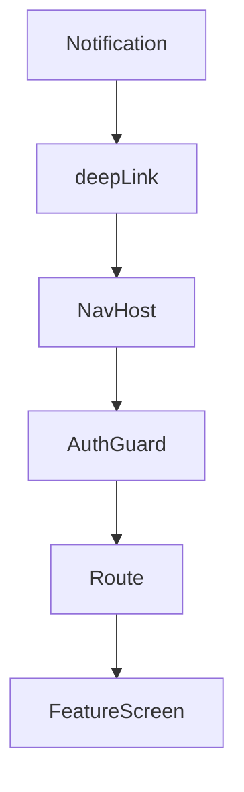

# RentWallet Android — Technology Decision Record (TDR v1.0)

**Document Status:** Approved
**Version:** 1.0
**Applies To:** RentWallet Android Application
**Preceding Document:** Software Architecture Specification (RAS v1.0)

---

## 1. Programming Language

### 1.1 Purpose
Select the primary programming language for all Android application development.

### 1.2 Candidates
- **Kotlin**
- **Java**
- **Mixed (Kotlin + Java)**

### 1.3 Evaluation

| Criteria | Kotlin | Java | Mixed |
|----------|--------|------|-------|
| Performance | Equivalent to Java on ART runtime | Baseline | Equivalent |
| Null Safety | Built-in (nullable types, safe calls) | Optional (requires annotations/linting) | Mixed; Kotlin files benefit, Java files do not |
| Coroutines | First-class language support (suspend, Flow) | Third-party (RxJava, CompletableFuture) | Fragmented patterns |
| DSL Capabilities | Builders, type-safe DSLs for Compose/Nav | No DSL support | Partial |
| Interop with Compose | Native (Compose is Kotlin-first) | Works via interop but verbose | Works |
| Learning Curve | Moderate (functional concepts, coroutines) | Low (familiar, verbose but simple) | Two paradigms to learn |
| Long-Term Viability | Industry standard for Android (Google-endorsed) | Legacy; Google direction is Kotlin-first | Maintenance burden across two languages |
| Testability | Excellent (kotlin.test, MockK, Turbine) | Excellent (JUnit, Mockito) | Two test frameworks in play |

### 1.4 Recommendation

**Kotlin — exclusively**

### 1.5 Justification

Kotlin is the natural choice for RentWallet because every layer of the RAS architecture benefits from Kotlin-specific features that Java cannot provide:

- **Coroutines and Flow** are the foundation of the RAS state management philosophy (StateFlow, SharedFlow, reactive data pipelines). Using Java would require a reactive library (RxJava) that introduces conceptual overlap and higher cognitive load.
- **Sealed classes** are essential for the RAS UiState/UiEvent pattern. Java's sealed classes (introduced in Java 17) are available but less ergonomic and require API 34+ desugaring.
- **Null safety** directly reduces runtime crashes in a production SaaS application. RentWallet handles user-generated data (payment amounts, lease terms) where null handling errors cause real financial data issues.
- **Compose** is Kotlin-first. The existing prototype is already 100% Kotlin. Introducing Java would serve no purpose and increase compilation time.
- **Backend compatibility is irrelevant** — the language decision is Android-only. Kotlin communicates with the Node.js backend via JSON/HTTP, which is language-agnostic.

### 1.6 Trade-offs

- Kotlin compilation is marginally slower than Java.
- Learning functional programming patterns (coroutines, sealed classes, Flows) requires investment, but the existing team has already written a Kotlin prototype.
- Kotlin multiplatform is not being used (native Android only), so the full multiplatform benefit is unrealized.

### 1.7 Long-Term Impact

| Dimension | Impact |
|-----------|--------|
| Scalability | Kotlin's concise syntax keeps feature files small as the app grows |
| Maintainability | Type-safe builders and null safety reduce bugs in large codebases |
| Testing | MockK and Turbine are Kotlin-native; test code mirrors production patterns |
| Onboarding | New hire must know Kotlin; this is the standard for Android in 2026 |
| Future Migration | Kotlin → Kotlin Multiplatform is straightforward (shared ViewModels, domain) if iOS is ever needed |

### 1.8 Alternatives Rejected

**Java (exclusively):** Rejected because Compose, RAS's chosen UI framework, requires Kotlin for ergonomic usage. Java would force verbose interop code and abandon coroutines in favor of RxJava or callbacks, both of which are inferior for the RASStateFlow-based state management.

**Mixed:** Rejected because maintaining two languages in a single codebase adds compilation complexity, requires both Kotlin and Java lint configurations, and fragments test strategy. The existing prototype is 100% Kotlin, so there is zero Java code to preserve.

---

## 2. UI Framework

### 2.1 Purpose
Select the UI rendering framework.

### 2.2 Candidates
- **Jetpack Compose**
- **XML Views**
- **Hybrid**

### 2.3 Evaluation

| Criteria | Jetpack Compose | XML Views | Hybrid |
|----------|----------------|-----------|--------|
| Development Speed | Fast (declarative, less boilerplate) | Moderate (XML + View binding) | Moderate (must maintain both) |
| State Integration | Native with MutableState, StateFlow | Requires LiveData or manual observer | Fragmented patterns |
| Theming | Built-in MaterialTheme, dynamic | Requires styles.xml, themes.xml | Two theme systems |
| Testability | ComposeTestRule, semantics | Espresso, UI Automator | Two test frameworks |
| Preview | @Preview composable (instant) | Layout Editor (slower) | Two preview systems |
| Learning Curve | Moderate (declarative paradigm) | Low (established knowledge) | Must learn both |
| Performance | Skia-based rendering, recomposition | View hierarchy, measure/layout/draw | Overhead of both systems |
| Long-Term Viability | Google's declared future | Maintenance mode (no new investment) | Temporary bridge, not a strategy |
| Prototype Status | The existing prototype is 100% Compose | N/A (no XML views exist) | Would require rewriting existing code |

### 2.4 Recommendation

**Jetpack Compose — exclusively**

### 2.5 Justification

The existing prototype is entirely Compose — 52 composable functions across 3,259 lines. Adopting XML Views would require rewriting the entire UI. Compose is the correct choice for RentWallet because:

- **State-driven UI aligns with RAS:** Compose's declarative model (UI = f(state)) directly maps to the RAS UiState pattern. Every screen renders a UiState sealed class — Compose is the only framework that natively supports this without adapters.
- **Theme consistency:** RentWallet's MaterialTheme-based design system (already partially defined in Color.kt, Theme.kt, Type.kt) maps directly to Compose's MaterialTheme. XML Views would require manual theme synchronization.
- **Preview-driven development:** The RAS calls for `@Preview` on every screen composable. Compose's instant preview enables rapid iteration without build-deploy cycles — critical for a team that will grow to multiple feature teams.
- **Performance for rental data:** Compose's recomposition granularity handles lists of properties, payment records, and alerts efficiently. The RentWallet UI is form-and-list heavy, not animation-heavy — Compose excels here.

### 2.6 Trade-offs

- Compose requires API 21+ (acceptable — RentWallet targets API 26+).
- Compose has a larger APK footprint than equivalent XML (~1-2MB additional from Compose runtime and Material3 libraries). Acceptable for a production SaaS app.
- Compose tooling (layout inspector, recomposition counts) is less mature than XML tooling. The gap is closing rapidly and does not affect decision.

### 2.7 Long-Term Impact

| Dimension | Impact |
|-----------|--------|
| Scalability | Compose recomposition scales well with many screens; no View hierarchy inflation overhead |
| Maintainability | Single source of truth (state in ViewModel, rendered in Composable) eliminates sync bugs |
| Testing | Compose UI tests are stable and fast; semantic matching is more robust than Espresso |
| Onboarding | New Android developers in 2026 learn Compose as primary framework |
| Future Migration | Compose Multiplatform for Wear OS, tablets, foldables is the same API |

### 2.8 Alternatives Rejected

**XML Views:** Rejected because the entire existing prototype is Compose. Introducing XML would require a complete rewrite of 52 composables into fragments, adapters, and layout files — a regression that contradicts the RAS migration strategy (Phase 2: extract, do not rewrite).

**Hybrid:** Rejected because maintaining two rendering systems doubles the UI surface area. Every UI change must be verified in both Compose and XML. The RAS feature-first architecture assumes a single UI paradigm.

---

## 3. Overall Architecture

### 3.1 Purpose
Select the architectural pattern that structures how the application code is organized.

### 3.2 Candidates
- **MVVM (Model-View-ViewModel)**
- **Clean Architecture**
- **MVVM + Clean Architecture**
- **MVI (Model-View-Intent)**
- **MVP (Model-View-Presenter)**

### 3.3 Evaluation

| Criteria | MVVM | Clean Architecture | MVVM + Clean | MVI | MVP |
|----------|------|-------------------|-------------|-----|-----|
| Layer Count | 3 (View, ViewModel, Model) | 3+ (UI, Domain, Data) | 4 (Composable, ViewModel, Domain, Data) | 3 (Model, View, Intent) | 3 (View, Presenter, Model) |
| State Management | StateFlow/LiveData in ViewModel | Any (no prescription) | StateFlow in ViewModel, UseCase for domain | Single sealed state + intent channel | Manual view updates |
| Testability | High (ViewModel tests without Android) | High (isolated layers) | Highest (isolated layers + testable VMs) | High (pure state machine) | Moderate (Presenter needs View interface) |
| Complexity | Low | Moderate | Moderate | Moderate | Low |
| Learning Curve | Low | Moderate | Moderate | High (functional patterns) | Low |
| Google Guidance | Official recommendation | Endorsed (architecture guide) | The "standard" for modern Android | Not officially recommended | Deprecated guidance |
| Prototype Fit | RAS already prescribes MVVM | RAS already prescribes domain/data layers | RAS already defines all four layers | Would require rethinking RAS | Would require rethinking RAS |
| Coroutine/Native | Yes | Yes | Yes | Yes | Not native |

### 3.4 Recommendation

**MVVM + Clean Architecture — as specified in RAS v1.0**

### 3.5 Justification

The RAS already defines a four-layer architecture (Composable → ViewModel → Domain → Data) that is a direct combination of MVVM (presentation layer pattern) and Clean Architecture (layer separation with dependency inversion). Adopting any other architecture would require redesigning the RAS.

This combination was chosen for RentWallet because:

- **VM + Domain separation isolates business rules.** The RAS identifies that RentWallet's business logic (rent calculations, payment validation, lease date math, role-based access) must live in domain-layer Use Cases, not in ViewModels or composables. MVVM alone would place business logic in ViewModels, making them harder to test and maintain.
- **Data layer independence enables offline-first.** Clean Architecture's repository abstraction means the composable and ViewModel never know whether data comes from the network, Room, or a cache. This is essential for RentWallet's future offline requirement.
- **Feature-first + Clean Architecture are compatible.** The RAS feature-first structure (feature/tenant/ui, feature/tenant/domain, feature/tenant/data) IS Clean Architecture within each feature.
- **No architectural mismatch.** The prototype currently mixes all responsibilities in one file. The RAS correctly decomposes those responsibilities into layers. MVVM + Clean Architecture is the destination.

### 6.6 Trade-offs

- Four layers introduce more files than two-layer MVVM. Every feature requires at minimum: Screen, ViewModel, UiState, UiEvent, UseCase, RepositoryInterface, RepositoryImpl — 7 files. This is acceptable for production quality.
- Clean Architecture's strict dependency rules require discipline during code review. The RAS dependency table mitigates this.
- ViewModels and UseCases are separate responsibilities — some argue this is over-engineering for simple screens. The RAS allows simplification: a feature with zero business logic may skip the UseCase and call the repository directly from the ViewModel.

### 3.7 Long-Term Impact

| Dimension | Impact |
|-----------|--------|
| Scalability | Each feature is independently scalable; adding a feature does not affect others |
| Maintainability | Layer isolation means a data layer change does not touch UI code |
| Testing | Each layer tested independently (UseCase: pure Kotlin test, ViewModel: StateFlow test, Composable: Compose UI test) |
| Onboarding | New developers learn a single pattern repeated across all features |
| Future Migration | Clean Architecture's abstract interfaces make it easy to swap implementations (e.g., Mock API → Real API) |

### 3.8 Alternatives Rejected

**MVVM alone (without domain/data layers):** Rejected because the RAS explicitly requires domain and data layers. RentWallet's business logic (rent pro-ration, payment status transitions, lease date calculations) cannot live in ViewModels without violating single responsibility. The RAS already analyzed and rejected this approach in the gap analysis (18% architecture fit).

**MVI:** Rejected despite its conceptual appeal. MVI adds an indirection layer (Intent → Reducer → State) that duplicates ViewModel's role. The RAS UiEvent pattern is already sufficiently close to MVI's intent channel without the strict reducer requirement. MVI's "single sealed state" is already part of the RAS' UiState pattern. Adding full MVI would provide marginal benefit at the cost of additional boilerplate.

**MVP:** Rejected. MVP requires the View to implement an interface that the Presenter calls. In Compose, the View is a function, not a class — making MVP's interface pattern awkward. Compose eliminates the need for a View interface because state is passed down as function parameters.

---

## 4. State Management

### 4.1 Purpose
Select the mechanisms for managing and propagating application state.

### 4.2 Candidates
- **StateFlow**
- **SharedFlow**
- **LiveData**
- **Compose State (mutableStateOf)**
- **SnapshotState**

### 4.3 Evaluation

| Criteria | StateFlow | SharedFlow | LiveData | Compose State | SnapshotState |
|----------|-----------|------------|----------|---------------|---------------|
| Initial Value | Required (state-holder) | None (event bus) | Required (via MutableLiveData) | Required (by constructor) | Part of Compose snapshot system |
| Null Safety | Kotlin-native | Kotlin-native | Nullable by design (Java legacy) | Kotlin-native | Kotlin-native |
| Lifecycle Awareness | Manual (repeatWithLifecycle) | Manual | Built-in (LifecycleOwner) | Recomposition only | Recomposition only |
| Testability | Excellent (StateFlow test) | Excellent (Turbine) | Moderate (getValue requires mocking lifecycle) | Moderate (require recomposition context) | Requires Compose test rule |
| Threading | Flow-based (flowOn, catch, retry) | Flow-based | Requires postValue on main thread | Automatic (Compose threading) | Automatic |
| Conflates Values | Yes | No | Yes | Yes | Yes |
| Cold/Hot | Hot | Hot | Hot | Hot | Hot |
| Use Case | Observable state | One-shot events | Observed by XML Views | Compose internal state | Snapshot delta tracking |

### 4.4 Recommendation

| Layer/Scenario | Technology | Rationale |
|---------------|------------|-----------|
| ViewModel → Screen | **StateFlow** | RAS-prescribed. Hot, state-holder, conflating, testable with Turbine. |
| One-shot events (snackbar, navigation) | **SharedFlow** | RAS-prescribed. Non-conflating, no initial value, emit-and-forget. |
| Composable-local state (text fields, animations) | **mutableStateOf** | Composable scoped, instant recomposition, no ViewModel needed for trivial state. |
| Data layer (Repository → ViewModel) | **Flow → StateFlow** | Data sources return Flow; ViewModel collects and converts to StateFlow. |

### 4.5 Justification

The RAS state management philosophy (section 9) already defines the assignment:

- **StateFlow** is the single source of truth for screen state. Every ViewModel exposes exactly one `StateFlow<UiState>`. StateFlow's conflating behavior ensures that rapid state updates do not trigger unnecessary recomposition — critical for payment processing flows where state transitions (Processing → Success/Failure) happen in rapid succession.
- **SharedFlow** handles one-shot events (navigation commands, snackbar messages) that should be delivered once and not replayed on configuration change. The RAS explicitly defines SharedFlow for this purpose.
- **Compose State (mutableStateOf)** is used only for UI-local state that is not relevant to the ViewModel: text field input, dropdown expansion, scroll position. This prevents sending trivial UI state to the ViewModel unnecessarily.
- **LiveData is rejected** because it was designed for XML Views. All RAS targets use Compose. LiveData's lifecycle awareness is unnecessary because `collectAsStateWithLifecycle()` achieves the same for StateFlow. Additionally, LiveData's null-default typing violates Kotlin's null safety philosophy.

### 4.6 Trade-offs

- StateFlow requires an initial value (loading state). This is not a drawback — the RAS requires an explicit loading state in UiState.
- SharedFlow requires remembering the emission (replay = 0) to avoid redelivery. Event loss is possible if the collector is not active. Mitigated by using `repeatOnLifecycle(STARTED)`.
- Mixing three state mechanisms (StateFlow, SharedFlow, mutableStateOf) requires clear conventions. The RAS coding standards section defines exactly when each is used.

### 4.7 Long-Term Impact

| Dimension | Impact |
|-----------|--------|
| Scalability | StateFlow/SharedFlow are hot flows — they scale linearly with number of collectors |
| Maintainability | Every screen follows the same pattern: UiState + onEvent. No surprises. |
| Testing | Turbine provides a clean API for testing both StateFlow and SharedFlow emissions |
| Onboarding | Pattern is simple: ViewModel has state (StateFlow), screen observes state, events emit on SharedFlow |
| Future Migration | StateFlow is Kotlin Coroutines — compatible with Kotlin Multiplatform, Flow, and all reactive libraries |

### 4.8 Alternatives Rejected

**LiveData:** Rejected because LiveData was designed for the XML Views lifecycle paradigm. In Compose, `collectAsStateWithLifecycle()` provides equivalent lifecycle awareness for StateFlow. LiveData also has nullable types by default, creating unnecessary null-handling overhead in Kotlin. LiveData's value-setting API is less flexible than StateFlow's `update {}` atomic operation.

**RxJava:** Rejected because RxJava is a third-party reactive library that adds significant APK size (~1.5MB) and API surface. Kotlin Coroutines/Flow provides equivalent reactive functionality with first-class language support and smaller footprint.

---

## 5. Dependency Injection

### 5.1 Purpose
Select the mechanism for managing dependency lifetimes, wiring, and provision.

### 5.2 Candidates
- **Hilt**
- **Dagger 2**
- **Koin**
- **Manual DI**

### 5.3 Evaluation

| Criteria | Hilt | Dagger 2 | Koin | Manual DI |
|----------|------|----------|------|-----------|
| Setup Time | Fast (annotations + plugin) | Slow (manual modules, components) | Fastest (no annotation processing) | Fast (no framework) |
| Compile-Time Safety | Yes (annotation processor) | Yes (annotation processor) | No (runtime resolution) | Yes (compile-time) |
| Boilerplate | Low (generated code) | High (manual components/scope) | Low (DSL) | Non-existent (manual) |
| Testing | Easy (test modules) | Moderate (test components) | Easy (start/stop mock modules) | Easiest (direct construction) |
| Learning Curve | Moderate | High (concepts: graph, scope, subcomponents) | Low | Minimal |
| LifecycleScope | Built-in (ViewModel, Activity, Fragment) | Manual | Built-in (via modules) | Manual |
| APK Size | ~500KB (Hilt + Dagger runtime) | ~500KB (Dagger runtime) | ~200KB | 0 |
| Compilation Time | Additional annotation processing | Additional annotation processing | No annotation processing | No overhead |

### 5.4 Recommendation

**Hilt**

### 5.5 Justification

Hilt is the correct DI framework for RentWallet because:

- **Official Google recommendation.** Hilt is the standard DI framework for modern Android applications. It is maintained by Google alongside Jetpack libraries, ensuring compatibility with Navigation Compose, ViewModel, Room, WorkManager, and all other RAS-selected technologies.
- **ViewModel injection is seamless.** Hilt's `@HiltViewModel` annotation integrates directly with `viewModel()` in Compose, requiring zero manual ViewModel factory code. This directly supports the RAS requirement that every screen has exactly one ViewModel created by the DI framework.
- **Scoping matches RAS layers.** Hilt's component hierarchy (Singleton → ViewModel → Activity → Fragment) maps cleanly to RAS scoping:
  - `@Singleton` for repositories, database, API service — one instance for the app lifetime.
  - `@ViewModelScoped` for use cases — one instance per screen, released when the screen leaves the backstack.
  - `@ActivityRetainedScoped` for navigation-related dependencies.
- **Testing infrastructure is mature.** Hilt's `@HiltAndroidTest` and `@HiltViewModel` test support enable isolated testing of ViewModels and repositories without mocking the DI framework itself.
- **The existing prototype has zero DI.** Introducing Hilt (Phase 7) will be the largest DI change regardless of framework choice. Hilt's compile-time safety ensures wiring errors are caught during compilation, not at runtime — critical for a production SaaS application.

### 5.6 Trade-offs

- Hilt adds ~500KB to APK size and ~5-10s to full compilation time (annotation processing). Acceptable for a production application.
- Hilt increases the learning curve for new developers unfamiliar with Dagger concepts (components, scopes, subcomponents).
- Hilt is a Dagger wrapper — if the team needs to customize the DI graph deeply, Dagger boilerplate surfaces through Hilt's API.
- Hilt requires the Hilt Gradle plugin and kapt/ksp configuration, adding build complexity.
- Hilt couples every module to its annotation processor. Switching DI frameworks later would require removing all annotations and replacing them.

### 5.7 Long-Term Impact

| Dimension | Impact |
|-----------|--------|
| Scalability | Hilt scales to any number of modules; feature modules register their own Hilt modules |
| Maintainability | Compile-time DI errors prevent runtime wiring failures — fewer production crashes |
| Testing | @HiltAndroidTest provides a first-class testing environment without mocking the DI framework |
| Onboarding | New features follow a template: `@HiltViewModel`, `@Module`, `@Provides` — repeated pattern |
| Future Migration | Hilt's annotation-based approach is compatible with Kotlin Multiplatform, Compose Multiplatform |

### 5.8 Alternatives Rejected

**Dagger 2 (directly, without Hilt):** Rejected because Dagger requires manual component and scope management that Hilt abstracts. For a 5+ feature application, the Dagger boilerplate (AppComponent, ActivityComponent, FeatureScopedComponent) would be substantial. Hilt provides the same compile-time safety with ~80% less boilerplate.

**Koin:** Rejected despite its simplicity and low learning curve. Koin resolves dependencies at runtime, meaning a missing binding is not detected until the code path executes. For a production SaaS application handling payments and lease data, runtime DI errors are unacceptable. Additionally, Koin's testing support (stop/restart Koin) is less ergonomic than Hilt's `@HiltAndroidTest`.

**Manual DI:** Rejected as a permanent strategy. Manual DI (constructing dependencies manually in Application or a DI container) would work for Phase 7 of the migration but would become unmaintainable at 5+ features. Every new feature would require:
- Creating repository instances
- Wiring use cases to repositories
- Wiring ViewModels to use cases
- Remembering to scope and release resources

Manual DI is acceptable for the migration bridge period but is not the long-term solution. The RAS explicitly requires a proper DI framework for the target architecture.

---

## 6. Networking Layer

### 6.1 Purpose
Select the HTTP client and networking library for communicating with the Node.js/Express.js backend.

### 6.2 Candidates
- **Retrofit**
- **Ktor Client**
- **Volley**
- **Native (HttpURLConnection / OkHttp directly)**

### 6.3 Evaluation

| Criteria | Retrofit | Ktor Client | Volley | Native |
|----------|----------|-------------|--------|--------|
| Type Safety | Yes (interface + annotations) | Yes (typed client) | No | No |
| Coroutine Support | Native (suspend functions) | Native (suspend functions) | Callback-based | Manual |
| Interceptor Chain | OkHttp interceptors | Built-in pipeline | Custom | Manual |
| Serialization | Pluggable (Kotlinx/Gson/Moshi) | Pluggable (Kotlinx Serialization) | Built-in | Manual |
| Multipart | `@Multipart` annotation | `submitFormWithBinaryData()` | `MultipartEntity` | Manual |
| Error Handling | CallAdapter (Result<T>) | HttpResponseValidator | `VolleyError` | Manual |
| Backend Compatibility | REST + any JSON API | REST + any JSON API | REST + any JSON API | Any |
| Testing | MockWebServer + MockRetrofit | MockEngine | Custom | MockWebServer |
| Ecosystem | Largest (OkHttp, Moshi, Gson, Kotlinx) | Growing (Ktor ecosystem) | Declining | Minimal |
| APK Size | ~300KB (OkHttp + Retrofit) | ~500KB (Ktor + engine) | ~100KB | 0 |

### 6.4 Recommendation

**Retrofit**

### 6.5 Justification

Retrofit is the correct networking layer for RentWallet because:

- **Type-safe API interfaces map directly to REST endpoints.** RentWallet's Node.js/Express.js backend exposes REST APIs with JSON bodies. Retrofit's annotation-based interface (`@GET`, `@POST`, `@Body`) defines each API endpoint as a Kotlin suspend function with typed DTOs. This directly supports the RAS data layer requirement that each feature's `data/` package contains an API service interface.
- **Coroutine integration is first-class.** Retrofit 3.x (rebase on Kotlin Coroutines) provides suspend function return types and `CallAdapter` for `Response<T>` and `Result<T>`. RentWallet's ViewModels call use cases that call repositories that call Retrofit services — each step is a suspend function in a structured concurrency context.
- **OkHttp is the standard HTTP engine.** OkHttp's interceptor chain enables JWT token injection, logging, retry, caching, and certificate pinning — all required by the RAS security strategy. Retrofit delegates to OkHttp, so every OkHttp feature is available without additional abstraction.
- **MockWebServer compatibility.** Integration tests for repositories use OkHttp's MockWebServer to verify API call behavior without a real server. This is critical for testing RentWallet's data layer in CI.
- **Backend compatibility.** The Node.js/Express.js backend speaks standard REST/JSON. Retrofit's serializer-agnostic design (Kotlinx Serialization, Moshi, Gson) adapts to any JSON format the backend produces.

### 6.6 Trade-offs

- Retrofit is a JVM-based annotation processor framework. It is not compatible with Kotlin Multiplatform (if iOS is ever needed). Ktor Client would be the multiplatform choice. For an Android-only application, this is not a concern.
- Retrofit requires an annotation processing step (kapt or ksp), adding ~3-5s to compilation time.
- Retrofit's annotation-based API is less flexible than Ktor's programmatic client for complex request/response processing (streaming, WebSockets, custom content negotiation).

### 6.7 Long-Term Impact

| Dimension | Impact |
|-----------|--------|
| Scalability | Adding endpoints means adding interface methods — no infrastructure changes needed |
| Maintainability | API contracts are visible in one interface per feature — easy to audit against backend routes |
| Testing | MockWebServer tests for every repository ensure data layer correctness |
| Onboarding | Any Android developer recognizes Retrofit — it is the most widely adopted Android networking library |
| Future Migration | If Kotlin Multiplatform is adopted, Ktor Client replaces Retrofit. The RAS repository abstraction isolates the networking layer, making this a one-package swap. |

### 6.8 Alternatives Rejected

**Ktor Client:** Rejected for Android-only development because Ktor's Android engine (OkHttp-based) adds an abstraction over OkHttp without significant benefit. Ktor's strength is multiplatform — since RentWallet is Android-only, Retrofit's simpler annotation-based API and broader ecosystem are preferable. If iOS becomes a requirement, Ktor Client would replace Retrofit behind the existing repository interfaces.

**Volley:** Rejected because Volley is callback-based and does not support Kotlin Coroutines natively. Volley's RequestQueue approach requires either wrapping every call in a coroutine adapter or using callbacks throughout the data layer — both incompatible with the RAS coroutine-first data flow. Additionally, Volley's ecosystem is in decline and does not support modern features like interceptors or type-safe serialization.

**Native (HttpURLConnection / OkHttp directly):** Rejected because raw HTTP clients require manual serialization, deserialization, error handling, and threading management. For a 5+ feature application with ~20+ API endpoints, the boilerplate would be substantial and error-prone. Retrofit's annotation-driven approach eliminates this boilerplate while providing compile-time API contract verification.

---

## 7. HTTP Client

### 7.1 Purpose
Select the underlying HTTP engine that handles connection pooling, interceptors, and network I/O.

### 7.2 Candidates
- **OkHttp**
- **Ktor (CIO engine)**
- **java.net.HttpURLConnection**

### 7.3 Evaluation

| Criteria | OkHttp | Ktor CIO | HttpURLConnection |
|----------|--------|----------|-------------------|
| Connection Pooling | Yes (built-in, configurable) | Yes (built-in) | No (manual) |
| Interceptors | Chain-based (addInterceptor, addNetworkInterceptor) | Pipeline-based | No (manual wrapping) |
| Certificate Pinning | Built-in (CertificatePinner) | Manual | Manual |
| Caching | Built-in (Cache + CacheInterceptor) | Manual | Manual |
| WebSocket | Yes (OkHttp WebSocket) | Yes | No |
| Timeout Configuration | Per-call (connect/read/write) | Per-call | Per-connection (limited) |
| Backend Compatibility | HTTP/1.1, HTTP/2, REST + any JSON API | HTTP/1.1, HTTP/2 | HTTP/1.1 only |
| Compile Time | 0 (no annotation processing) | 0 | 0 |
| APK Size | ~300KB | ~500KB (Ktor-core + CIO engine) | 0 (built-in) |

### 7.4 Recommendation

**OkHttp**

### 7.5 Justification

OkHttp is the de facto standard HTTP engine for Android and is the default engine for Retrofit. The choice is straightforward:

- **Retrofit (networking layer) uses OkHttp internally.** Selecting OkHttp is not optional — it is inherent to the Retrofit decision.
- **Interceptor chain for RentWallet requirements.** OkHttp's interceptor chain enables:
  - **Auth interceptor:** Every request (except auth endpoints) gets a `Bearer <token>` header injected from the auth repository.
  - **Logging interceptor:** Debug-level logging of request/response bodies for development.
  - **Header interceptor:** Content-Type, Accept-Language, and correlation ID headers on every request.
  - **Retry interceptor:** Automatic retry on timeout or 5xx errors for idempotent requests.
- **Certificate pinning:** OkHttp's `CertificatePinner` supports the RAS security strategy requirement for certificate pinning in production.
- **Connection pooling:** Reuses connections across API calls, reducing latency for RentWallet's frequent API calls (dashboard refresh, payment list, notification polling).

### 7.6 Trade-offs

- OkHttp's interceptor chain adds minimal (~1-2ms) per-request overhead. Acceptable.
- OkHttp adds ~300KB to APK. Acceptable.
- OkHttp is tied to the JVM ecosystem and cannot be used in Kotlin Multiplatform common code. Not relevant for Android-only.

### 7.7 Long-Term Impact

| Dimension | Impact |
|-----------|--------|
| Scalability | Connection pooling and HTTP/2 multiplexing scale to 50+ API endpoints |
| Maintainability | Interceptor chain centralizes cross-cutting concerns (auth, logging, headers) |
| Testing | MockWebServer is an OkHttp-first testing tool — no adapter needed |
| Onboarding | OkHttp is the standard HTTP engine; every Android developer is familiar with interceptors |
| Future Migration | Retrofit's OkHttp dependency means swapping OkHttp requires swapping Retrofit. Unlikely scenario. |

### 7.8 Alternatives Rejected

**Ktor CIO engine:** Rejected because Ktor Client itself was rejected for the networking layer. If Ktor Client were selected, Ktor CIO (non-blocking I/O engine) would be the engine. Since Retrofit is selected, OkHttp is the natural engine.

**HttpURLConnection:** Rejected because it lacks interceptors, connection pooling, certificate pinning, and HTTP/2 support. These are all required features for a production SaaS application.

---

## 8. Serialization

### 8.1 Purpose
Select the JSON serialization/deserialization library for converting between Kotlin data classes and JSON for API communication and local storage.

### 8.2 Candidates
- **Kotlinx Serialization**
- **Moshi**
- **Gson**

### 8.3 Evaluation

| Criteria | Kotlinx Serialization | Moshi | Gson |
|----------|----------------------|-------|------|
| Annotation Processing | Compiler plugin (no kapt) | Codegen via kapt/ksp | Reflection-based (slow) or codegen (kapt) |
| Kotlin Null Safety | Native (nullable/non-null mapped) | Supports nullable via annotation | Does NOT support Kotlin null safety by default (requires TypeAdapter) |
| Compile Time | Fastest (compiler plugin) | Moderate (kapt/ksp) | Fastest (reflection, no processing) |
| APK Size | ~100KB (runtime) | ~200KB (runtime + moshi) | ~250KB (Gson jar) |
| Coroutine Support | encodeToStream/decodeToStream | Manual | Manual |
| Multiplatform | Yes (Kotlin Multiplatform) | No (JVM only) | No (JVM only) |
| Android Compatibility | Fully compatible | Fully compatible | Fully compatible |
| Custom Adapters | Plugin-based (Serializer) | JsonAdapter annotation | TypeAdapter / JsonSerializer |
| Default Values | Respects Kotlin default values | Requires @DefaultJson annotation | Does not respect defaults |
| ProGuard | Minimal config | Minimal config | Requires keep rules |
| Backend Compatibility | Maps any JSON structure | Maps any JSON structure | Maps any JSON structure |

### 8.4 Recommendation

**Kotlinx Serialization**

### 8.5 Justification

Kotlinx Serialization is the correct choice for RentWallet because:

- **Kotlin-native null safety.** Kotlinx Serialization directly maps Kotlin's nullable types (`String?`, `Int?`) to JSON null/absent fields. Gson does not — it returns default values for missing fields, masking data issues. For RentWallet's payment and lease data, a missing field is a data integrity concern, not a default.
- **Kotlin default values are respected.** RentWallet's DTOs will evolve as the backend adds fields. Kotlinx Serialization's `@EncodeDefault` and `@Optional` annotations handle backward-compatible API changes without breaking existing code. Gson ignores default values entirely.
- **Compiler plugin, not kapt.** Kotlinx Serialization uses the Kotlin compiler plugin, which is faster and does not require kapt/ksp configuration. This reduces build complexity compared to Moshi's codegen approach.
- **Compatibility with Retrofit.** Retrofit supports Kotlinx Serialization via the `retrofit2-kotlinx-serialization-converter` converter factory. This is the standard integration path.
- **Multiplatform-ready.** While RentWallet is Android-only, Kotlinx Serialization's multiplatform capability means serialization logic is portable if the codebase ever moves to Kotlin Multiplatform.

### 8.6 Trade-offs

- Kotlinx Serialization requires the `kotlinx-serialization-json` compiler plugin in every module that uses it. Build configuration must include `id("org.jetbrains.kotlin.plugin.serialization")`.
- Kotlinx Serialization uses `@Serializable` annotations. If RentWallet ever integrates with a library that expects a different format (e.g., MongoDB Realm's BSON), a manual serializer adapter is needed.
- Kotlinx Serialization's serializers are `inline` — they cannot be overridden at runtime. For dynamic serialization scenarios, Moshi's `RuntimeJsonAdapterFactory` is more flexible.

### 8.7 Long-Term Impact

| Dimension | Impact |
|-----------|--------|
| Scalability | Adding DTOs is a single annotation — no manual adapter code needed per DTO |
| Maintainability | Kotlin default value support ensures backward-compatible API evolution without breaking changes |
| Testing | Serialization tests are straightforward: `Json.decodeFromString<Dto>(jsonString)` |
| Onboarding | @Serializable is intuitive — one annotation on a data class |
| Future Migration | Kotlinx Serialization is the only multiplatform option. If iOS is added, serialization code is immediately portable. |

### 8.8 Alternatives Rejected

**Gson:** Rejected because Gson does not support Kotlin's null safety, default values, or data class semantics without extensive custom TypeAdapter code. Gson's reflection-based approach is also slower and incompatible with R8/ProGuard without explicit keep rules. For a production application handling financial data, Gson's silent default-value behavior (null → default, missing field → default) introduces hard-to-detect bugs.

**Moshi:** Rejected despite its excellent Kotlin support and codegen capabilities. Moshi requires kapt or ksp annotation processing, adding build complexity. Kotlinx Serialization's compiler plugin approach is faster, requires less configuration, and provides identical functionality. Moshi is a strong alternative, but Kotlinx Serialization's multiplatform readiness and Google endorsement tip the balance.

---

## 9. Local Database

### 9.1 Purpose
Select the local database technology for offline data persistence, caching, and local-first data operations.

### 9.2 Candidates
- **Room**
- **SQLite (raw)**
- **Realm**
- **ObjectBox**

### 9.3 Evaluation

| Criteria | Room | SQLite (raw) | Realm | ObjectBox |
|----------|------|-------------|-------|-----------|
| Type Safety | Yes (DAO + Entity annotations) | No (raw SQL) | Yes (managed objects) | Yes (entities + queries) |
| Coroutine Support | Native (suspend DAOs, Flow return types) | Manual (with support lib) | Coroutine adapter available | Native (Kotlin coroutines) |
| Compile-Time Verification | Yes (SQL validation at compile time) | No (runtime SQL errors) | No (managed objects with annotation processing) | Yes (annotation-based queries) |
| Learning Curve | Low (SQL-like queries) | Moderate | Low (object-oriented) | Low |
| Migrations | Auto-migration + manual SQL | Manual ALTER TABLE | Manual (requires schema export) | Manual |
| APK Size | ~100KB (Room runtime) | ~50KB (support lib only) | ~3-5MB (Realm core) | ~500KB |
| Testing | Room.inMemoryDatabaseBuilder | Manual (SQLite in-memory) | Realm test config | ObjectBox test lib |
| Backend Compatibility | Maps any data model via DAO | Maps any data model | Separate from backend schema | Separate from backend schema |
| Multiplatform | No (JVM only) | No | Yes (Java, Kotlin, JS) | Yes (Android, iOS, JVM) |
| Offline Support | Excellent (Flow-based observability) | Manual | Good (auto-refresh) | Good (Rx/Flow-based) |

### 9.4 Recommendation

**Room**

### 9.5 Justification

Room is the correct local database for RentWallet because:

- **First-class Kotlin Coroutines support.** Room DAOs return `Flow<T>` and `suspend` functions natively. This directly supports the RAS data flow: Repository calls DAO → gets `Flow<List<Entity>>` → maps to domain models → ViewModel collects StateFlow from repository. No adapter layer needed.
- **Compile-time SQL verification.** Room validates SQL queries at compile time. For RentWallet's complex queries (payment history by property, lease status by date, overdue rent calculation), compile-time verification catches SQL errors before they reach production.
- **Type-safe migrations.** Room's auto-migration (`@AutoMigration`) handles schema changes automatically. For a SaaS app that will evolve its schema across releases, Room reduces migration bugs significantly compared to raw SQLite.
- **Integration with the RAS data layer.** Room's Entity/DAO pattern maps directly to the RAS data layer structure: `feature/*/data/local/` contains entities and DAOs. The Repository implementation orchestrates Room (local) and Retrofit (remote) — this is Room's primary design pattern.
- **Google-maintained.** Room is part of the Android Jetpack suite and is guaranteed to receive long-term maintenance and compatibility with future Android versions.

### 9.6 Trade-offs

- Room requires Entity classes that are separate from domain models. DTO → Entity → Domain model mapping is required, adding one mapper layer. This is a feature, not a bug — it enforces layer separation as required by the RAS.
- Room's annotation processing adds build time. Acceptable.
- Room does not support Kotlin Multiplatform (it is Android-only). If iOS support is needed, SQLDelight or a KMP-compatible database would replace Room. The RAS repository abstraction isolates the database, making this a contained swap.

### 9.7 Long-Term Impact

| Dimension | Impact |
|-----------|--------|
| Scalability | Room handles 5-50 features easily; DAOs are organized by feature |
| Maintainability | Compile-time SQL validation prevents production data access bugs |
| Testing | Room.inMemoryDatabaseBuilder provides fast, isolated database tests without an emulator |
| Onboarding | Room is the standard Android database — DAO + Entity pattern is widely understood |
| Future Migration | Repository pattern isolates Room. Switching to SQLDelight or a KMP database requires changing only the data layer's local implementation. |

### 9.8 Alternatives Rejected

**SQLite (raw):** Rejected because raw SQLite requires manual cursor management, manual migration handling, manual threading, and manual Flow adapters. For a production app with 5+ features, this is unsustainable engineering overhead. Room provides all the same SQL capabilities with automated boilerplate.

**Realm:** Rejected because Realm adds ~3-5MB to APK size, has a separate persistence engine that operates independently of SQL, and requires managed Realm objects that couple tightly to the Realm framework. Additionally, Realm's Kotlin coroutine support requires an adapter, increasing cognitive overhead. Realm's APK size impact alone is unacceptable for a production app where every megabyte matters for download conversion.

**ObjectBox:** Rejected because ObjectBox is a non-SQL database that uses a proprietary query API. While it offers excellent performance, its departure from SQL means:
- The team must learn a new query paradigm (not SQL).
- Backend data is typically stored in a SQL-like format; importing into ObjectBox requires schema transformation.
- ObjectBox's community and ecosystem are smaller than Room's.
- Room's SQL-based approach matches the team's likely existing SQL knowledge.

---

## 10. Preferences & Secure Storage

### 10.1 Purpose
Select the storage technology for application preferences, settings, authentication tokens, and sensitive user data.

### 10.2 Candidates
- **DataStore**
- **SharedPreferences**
- **EncryptedSharedPreferences**
- **Android Keystore**

### 10.3 Evaluation

| Criteria | DataStore | SharedPreferences | EncryptedSharedPreferences | Android Keystore |
|----------|-----------|-------------------|----------------------------|------------------|
| Async | Yes (Flow-based) | No (blocking disk I/O) | No (blocking disk I/O) | No (blocking crypto ops) |
| Type Safety | Protocol Buffers or Preferences | String keys only | String keys only | Key references only |
| Thread Safety | Built-in (coroutine-based) | Not safe (must use apply/commit carefully) | Not safe | Not applicable |
| Coroutine Support | Native (Flow + suspend) | No | No | No |
| Encryption | Not built-in (use with security lib) | None | AES-256 (AndroidKeyStore) | Keys are stored in hardware-backed storage |
| Use Case | Preferences, settings, onboarding state | Legacy settings | Auth tokens, sensitive values | Cryptographic key generation |
| Migration Path | From SharedPreferences | Legacy only | From EncryptedSP | N/A |
| APK Size | ~50KB (DataStore lib) | 0 (built-in) | ~50KB (security-crypto) | 0 (system service) |

### 10.4 Recommendation

| Storage Need | Technology | Rationale |
|-------------|------------|-----------|
| App preferences, feature flags, onboarding state | **DataStore (Preferences)** | Async, Flow-based, coroutine-native. Aligns with RAS reactive state philosophy. |
| Auth tokens, refresh tokens, sensitive config | **EncryptedSharedPreferences** | AES-256 encryption at rest. Tokens are read at app start (one-shot, not reactive). |
| Cryptographic keys (biometric keys, encryption keys) | **Android Keystore** | Hardware-backed key storage. Required for future biometric and encryption features. |

### 10.5 Justification

- **DataStore for preferences** because the RAS state management uses StateFlow throughout. DataStore's Flow-based API means preferences (dark mode, notification settings, onboarding completion) are exposed as `Flow<T>` and observable in ViewModels and composables. SharedPreferences' blocking disk I/O on the main thread is incompatible with modern Android development.
- **EncryptedSharedPreferences for tokens** because auth tokens (JWT access + refresh tokens) are the most sensitive data in the application. They must be encrypted at rest. EncryptedSharedPreferences wraps SharedPreferences with AES-256 encryption via the AndroidKeyStore — no additional crypto code needed.
- **Android Keystore for keys** because it is the Android platform's secure key storage. Future features (biometric authentication, data encryption at rest for offline data) will require generating and storing cryptographic keys. Keystore ensures keys are hardware-backed and not extractable from the device.

### 10.6 Trade-offs

- Three storage technologies introduce complexity. Mitigated by strict rules: if it is a preference (boolean, string for settings), use DataStore. If it is a credential (JWT, API key), use EncryptedSharedPreferences. If it is a cryptographic key, use Keystore. No overlap.
- DataStore's Preference-based API (not Proto) limits schema evolution. For structured preferences (user settings model), Proto DataStore would be used instead of Preferences DataStore. RentWallet's settings are simple key-value pairs initially — Preferences DataStore is sufficient.
- EncryptedSharedPreferences is still synchronous (blocking on disk + AES-256 decrypt). The JWT token read at app startup may add ~10-20ms. Acceptable — this is a one-time cost.

### 10.7 Long-Term Impact

| Dimension | Impact |
|-----------|--------|
| Scalability | DataStore scales to any number of preference keys without performance degradation |
| Maintainability | Three storage responsibilities with clear boundaries. Any new storage need maps to one of three. |
| Testing | DataStore's Flow-based API is testable with `FlowTurbine`. EncryptedSharedPreferences can be replaced with a fake for tests. |
| Onboarding | Pattern is simple: settings → DataStore, tokens → EncryptedSP, keys → Keystore |
| Future Migration | DataStore is Google's recommended replacement for SharedPreferences. No future migration needed. |

### 10.8 Alternatives Rejected

**SharedPreferences for preferences:** Rejected because SharedPreferences performs synchronous disk I/O on the calling thread. Called from the main thread (common pattern), it causes jank. Called from a coroutine (workaround), it requires `Dispatchers.IO` wrapping. DataStore's Flow-based async API eliminates this issue entirely. Google officially recommends DataStore over SharedPreferences.

**SharedPreferences for tokens:** Rejected because tokens must be encrypted at rest. Unencrypted SharedPreferences stores values as plaintext XML files on disk, accessible to any app with the same UID or via ADB backup.

**DataStore for tokens:** Rejected because DataStore does not provide built-in encryption. Encrypting DataStore manually requires encrypting the file at the filesystem level (requiring Android Security Crypto library anyway) or wrapping values before writing. EncryptedSharedPreferences is simpler for the token use case.

---

## 11. Background Processing

### 11.1 Purpose
Select the mechanism for executing deferred, periodic, or guaranteed background work.

### 11.2 Candidates
- **WorkManager**
- **Foreground Services**
- **AlarmManager**
- **Coroutines (direct)**

### 11.3 Evaluation

| Criteria | WorkManager | Foreground Services | AlarmManager | Coroutines |
|----------|-------------|---------------------|--------------|------------|
| Deferred Work | Yes (OneTimeWorkRequest) | No | No | Limited (with delay) |
| Periodic Work | Yes (PeriodicWorkRequest) | No | Yes (setRepeating) | No |
| Work Guarantee | Yes (persists across reboots) | No (killed with process) | Yes (persists) | No |
| Battery Constraints | Yes (network, battery, idle) | No (user-visible notification) | Limited | No |
| Chaining | Yes (beginWith, then, combine) | No | No | Structured concurrency |
| OS Kill Resilience | Yes (rescheduled) | No (killed if system kills app) | Yes (rescheduled) | No |
| Compose Integration | Observing work status via LiveData/Flow | No | No | Direct launch |
| Testability | WorkManagerTestInitHelper | Hard (UI-dependent) | Hard (system service) | Easy (runBlockingTest) |

### 11.4 Recommendation

| Work Type | Technology | Rationale |
|-----------|------------|-----------|
| Deferred/periodic background processing | **WorkManager** | Rent calculation, notification sync, data refresh. Guaranteed execution across app restarts. |
| Long-lived user-visible operations | **Foreground Services** | Future: uploading maintenance photos, syncing large data sets. Must show notification. |
| Network calls, DB writes in app process | **Coroutines (viewModelScope, coroutineScope)** | All ViewModel, UseCase, Repository operations. Normal app-in-progress work. |

### 11.5 Justification

- **WorkManager for background processing** because RentWallet will require guaranteed background work:
  - Periodic data sync (refresh property dashboard from backend every 15 minutes).
  - Deferred notification processing (check for new alerts when app is backgrounded).
  - Future: offline payment queue processing (retry failed payment submissions when connectivity is restored).
  - WorkManager persists work requests across device reboots and can enforce constraints (network available, battery not low, device idle).
- **Foreground Services for user-visible operations** because Android requires a visible notification for any long-running background operation. Future photo upload or data export features will use a foreground service with a progress notification.
- **Coroutines for in-process work** because the RAS data flow uses coroutines at every layer. ViewModel launches use cases in `viewModelScope`, repositories launch data source calls in `coroutineScope`. No WorkManager or Service is needed for in-process operations.

### 11.6 Trade-offs

- WorkManager adds ~100KB to APK. Acceptable.
- Foreground Services require a persistent notification. User-perceived cost for long operations but unavoidable per Android policy.
- WorkManager's minimum interval for periodic work is 15 minutes. For shorter intervals, coroutine timers or AlarmManager are needed.

### 11.7 Long-Term Impact

| Dimension | Impact |
|-----------|--------|
| Scalability | WorkManager handles any number of work requests with constraint-based scheduling |
| Maintainability | WorkManager work is defined as Worker classes — testable, predictable, isolated |
| Testing | WorkManagerTestInitHelper provides first-class testing for background work |
| Onboarding | WorkManager is the standard Android background scheduler — widely understood |
| Future Migration | WorkManager is part of Android Jetpack — no future migration needed |

### 11.8 Alternatives Rejected

**AlarmManager:** Rejected because AlarmManager only provides time-based scheduling without constraint awareness (network, battery). WorkManager is built on AlarmManager + JobScheduler + FirebaseDispatcher and provides the same scheduling capabilities with constraint support.

**Coroutines (direct):** Rejected for guaranteed background work because coroutines launched in the application scope are killed when the app process is terminated. For work that must survive process death (payment queue processing, sync), a system-scheduled mechanism is required.

---

## 12. Image Loading

### 12.1 Purpose
Select the image loading library for displaying network images (property photos, user avatars, document scans).

### 12.2 Candidates
- **Coil**
- **Glide**
- **Picasso**

### 12.3 Evaluation

| Criteria | Coil | Glide | Picasso |
|----------|------|-------|---------|
| Kotlin-first | Yes (coroutines, suspend functions) | No (Java-based) | No (Java-based) |
| Compose Integration | Native (`AsyncImage` composable) | `GlideImage` compose adapter | `rememberPicasso` compose adapter |
| Caching | Disk + memory (OkHttp-based) | Disk + memory | Disk + memory (smaller cache) |
| Animated Images | AnimatedVectorDrawable, GIF | GIF, WebP, Video | GIF only |
| Placeholder | Built-in (placeholder, error, fallback) | Built-in | Built-in |
| Transformations | Built-in (circle crop, blur, grayscale) | Extensive (built-in + custom) | Basic |
| APK Size | ~150KB | ~500KB | ~120KB |
| Image Formats | JPEG, PNG, WebP, HEIF, SVG, GIF | JPEG, PNG, WebP, GIF, Video frames | JPEG, PNG, WebP, GIF |
| Performance | OkHttp-based caching, memory-efficient | Highly optimized (BitmapPool) | Fast but less optimized |
| Testing | Testable via FakeImageLoader | Mock Glide module | Mock Picasso instance |

### 12.4 Recommendation

**Coil**

### 12.5 Justification

Coil is the correct image loading library for RentWallet because:

- **Native Compose integration.** Coil's `AsyncImage` composable handles everything: loading, placeholder, error, and fallback states — without a separate View or wrapper. This directly supports the RAS principle that composables should be self-contained.
- **Kotlin Coroutines-first.** Coil's entire API is built on coroutines (suspend functions, Flow integration). Coil runs image loading in `Dispatchers.IO` internally, with automatic cancellation when the composable leaves composition. This aligns with the RAS coroutine-first data flow.
- **OkHttp cache reuse.** Coil uses OkHttp as its network engine (and can reuse the app's existing OkHttp instance). This means HTTP caching (ETag, Cache-Control) from the backend is automatically respected — reducing redundant image downloads for property photos.
- **Small APK footprint.** Coil adds ~150KB versus Glide's ~500KB. For an app with image-heavy features (property photos, maintenance documents), the difference matters.
- **Compose @Preview compatible.** Coil's `FakeImageLoader` API allows testing image loading in composable previews and UI tests without a network connection.

### 12.6 Trade-offs

- Coil's transformation library is smaller than Glide's. For complex image editing (blur, watermark, custom GPU filters), Glide has more options. RentWallet's image needs are basic (circle crop for avatars, thumbnail generation for property photos) — Coil covers these.
- Coil's animated image support is limited to GIF and AnimatedVectorDrawable. Glide also supports Video frames and WebP animations.
- Coil's community is smaller than Glide's, but it is the officially recommended Compose image library.

### 12.7 Long-Term Impact

| Dimension | Impact |
|-----------|--------|
| Scalability | Coil's OkHttp-backed caching scales to thousands of images — LRU eviction with configurable max size |
| Maintainability | AsyncImage composable = one line per image. No View binding, no ImageView lifecycle management. |
| Testing | FakeImageLoader enables screenshot tests with predictable image data |
| Onboarding | `AsyncImage(model = url, contentDescription = ...)` is intuitive |
| Future Migration | Coil is the standard Compose image library — no migration needed |

### 12.8 Alternatives Rejected

**Glide:** Rejected because Glide's Java-based API requires adapter layers for Compose (GlideImage). While Glide's performance (BitmapPool, recycling) is excellent, Coil provides equivalent performance for RentWallet's use case (primarily JPEG/PNG property photos) with a more idiomatic Kotlin/Compose API. Glide's ~500KB APK size is also significantly larger than Coil's ~150KB.

**Picasso:** Rejected because Picasso is in maintenance mode (no active development) and lacks Compose integration. Picasso's smaller default cache size and lack of coroutine support make it unsuitable for a modern Compose application.

---

## 13. Navigation

### 13.1 Purpose
Select the navigation framework for managing screen transitions, backstack handling, and deep link routing.

### 13.2 Candidates
- **Navigation Compose**
- **Custom (manual) Navigation**
- **Voyager**
- **Decompose**

### 13.3 Evaluation

| Criteria | Navigation Compose | Custom Navigation | Voyager | Decompose |
|----------|-------------------|-------------------|---------|-----------|
| Type Safety | Route sealed class + navArgs | Manual | Route sealed class | Component-based |
| Deep Links | Built-in (navDeepLink) | Manual | Custom | Manual |
| Backstack | Built-in (NavHost + backStackEntry) | Manual (backstack composable) | Built-in | Built-in |
| Hilt Integration | @HiltViewModel + viewModel() | Manual | Manual | Manual |
| Animation | Built-in (AnimatedNavHost, enterTransition) | Manual (AnimatedContent) | Built-in | Built-in |
| Testing | NavHostTestController | Manual | Test utils | Test utils |
| Learning Curve | Low (Jetpack standard) | Low | Moderate | High (multi-platform patterns) |
| Google Support | Yes (part of AndroidX) | N/A | No | No |
| Compose Native | Yes | Yes | Yes | Yes |
| Multiplatform | No (Android only) | N/A | Yes (KMP) | Yes (KMP) |

### 13.4 Recommendation

**Navigation Compose**

### 13.5 Justification

Navigation Compose is the correct choice for RentWallet because:

- **Direct mapping to the RAS navigation philosophy (section 10).** The RAS defines: Route sealed class, 4-graph hierarchy, auth guard, deep links. Navigation Compose provides:
  - `NavHost` with route composition (matching the RAS graph structure).
  - `NavType` serialization for route arguments.
  - `navDeepLink` for push notification deep linking.
- **Hilt integration.** Navigation Compose's `viewModel()` function integrates seamlessly with Hilt's `@HiltViewModel`. Each screen gets its ViewModel automatically scoped to the navigation backstack entry. No manual factory code.
- **Type-safe routes (with Serialization plugin).** Navigation Compose 2.8+ supports type-safe route definitions using Kotlinx Serialization. This matches the RAS prescriptive routing.
- **Backstack management.** The RAS defines that each feature graph manages its own backstack. Navigation Compose's nested `NavHost` pattern supports this exactly.

### 13.6 Trade-offs

- Navigation Compose is Android-only. If Kotlin Multiplatform is adopted, Voyager or Decompose would replace it.
- Navigation Compose's deep link handling requires declaring `navDeepLink` in code and matching `intent-filter` in AndroidManifest.xml — the route definition is in two places.
- Navigation Compose's argument deserialization is less flexible than custom navigation for complex argument objects.

### 13.7 Long-Term Impact

| Dimension | Impact |
|-----------|--------|
| Scalability | Adding a feature = adding a NavGraph = registering in AppNavHost. No modification to existing routes. |
| Maintainability | Route changes are compile-time visible; no runtime route string mismatches. |
| Testing | NavHostTestController provides isolated navigation testing without launching the Activity. |
| Onboarding | Navigation Compose is the standard Android navigation library — widely understood. |
| Future Migration | If KMP is adopted, the navigation layer is replaced. The route definitions are preserved in the Route sealed class. |

### 13.8 Alternatives Rejected

**Custom (manual) Navigation:** Rejected because the RAS defines a specific navigation architecture that would require reimplementing backstack management, deep link parsing, and state restoration. Navigation Compose provides these features for free. Custom navigation would be redundant engineering effort.

**Voyager:** Rejected because it is a third-party library not officially supported by Google. Voyager's multiplatform capability is not needed for Android-only. Navigation Compose's Google backing ensures long-term compatibility with future Android releases.

**Decompose:** Rejected because its component-based architecture introduces a different architectural paradigm (lifecycle-aware components) that does not map cleanly to the RAS feature-first structure. Decompose is designed for multiplatform applications — over-engineering for Android-only.

---

## 14. Logging

### 14.1 Purpose
Select the logging strategy and library for development debugging, production monitoring, and audit trails.

### 14.2 Candidates
- **Timber**
- **Android Log (android.util.Log)**
- **Structured Logging (custom or library-based)**

### 14.3 Evaluation

| Criteria | Timber | Android Log | Structured Logging |
|----------|--------|-------------|-------------------|
| Tag Management | Automatic (class name) | Manual (TAG constant) | Custom |
| Log Levels | Debug, Info, Warn, Error, Wtf | Verbose, Debug, Info, Warn, Error, Assert | Configurable |
| Plant Architecture | Yes (Tree API, custom plantations) | No | Custom implementation |
| Crash Reporting Integration | Plant → Crashlytics | Manual | Custom |
| Release Build | Debug Tree removed automatically | Manual if-check | Configurable |
| Structured Format | No (plain text) | No (plain text) | JSON or structured format |
| Production Strategy | Let crash reporter handle errors | Strip debug logs manually | Structured logs → remote logging |

### 14.4 Recommendation

**Timber** for development logging
**Structured logging** for production audit trails

### 14.5 Justification

- **Timber for development** because:
  - Automatic tag generation (no `const val TAG = "..."` in every file).
  - Plant architecture allows different logging configurations for debug (logcat) and release (Crashlytics).
  - Debug-only logs are automatically stripped in release builds when using the release tree.
  - The `@DebugLog` annotation in Timber can log function entry/exit with parameters — useful for debugging complex payment and lease flows.
- **Structured logging for production** because RentWallet handles financial transactions (payment processing, lease agreements). For audit compliance and debugging production issues, structured logs (JSON format with timestamps, correlation IDs, feature context) are more useful than plain text logcat output. A `StructuredLogTree` can format logs as JSON and write them to a log file or send them to a remote logging service.

### 14.6 Trade-offs

- Timber is a thin wrapper over Android Log — it does not provide structured logging. Structured logging must be implemented as a custom Tree.
- Structured logging adds ~1-5ms per log statement (JSON serialization). For high-volume debug logs, this adds overhead. Mitigated by only using structured logging for info/warn/error levels, not verbose/debug.
- Remote structured logging requires network access. Offline logs must be queued.

### 14.7 Long-Term Impact

| Dimension | Impact |
|-----------|--------|
| Scalability | Logging is centralized; adding a new feature requires no logging configuration |
| Maintainability | Tag management is automated — no manual TAG constants |
| Testing | Timber trees can be replaced in tests to verify log output |
| Onboarding | One line of setup per class: `Timber.d("message")` |
| Future Migration | Timber is a standard library — no migration needed |

### 14.8 Alternatives Rejected

**Android Log (raw):** Rejected because it requires manual TAG constants, manual debug-build checking, and manual integration with crash reporting. Timber provides all the same capabilities with zero boilerplate while being a thin wrapper that adds minimal overhead.

**Structured logging only (no Timber):** Rejected because structured logging configuration (JSON format, remote endpoint, offline queue) is over-engineering for debug-level development logs. Timber handles debug logging with zero configuration; structured logging handles production-level logging with deliberate configuration.

---

## 15. Testing Strategy

### 15.1 Purpose
Design the complete testing approach covering all layers of the RAS architecture.

### 15.2 Candidates
- **JUnit 5** — Test framework
- **MockK** — Kotlin mocking library
- **Mockito** — Java mocking library
- **Turbine** — Flow/StateFlow testing
- **Compose UI Test** — UI interaction + assertion
- **Robolectric** — JVM Android framework testing
- **Instrumentation Tests** — Device/emulator testing

### 15.3 Evaluation

| Criteria | JUnit 5 | MockK | Mockito | Turbine | Compose UI Test | Robolectric | Instrumentation |
|----------|---------|-------|---------|---------|-----------------|-------------|-----------------|
| Kotlin Native | Yes | Yes | No (Java-first) | Yes | N/A | Mixed | N/A |
| Coroutine Testing | `@Timeout` + `runTest` | `coEvery`, `coVerify` | `CompletableFuture` wrapping | collect/awaitItem | N/A | Limited | N/A |
| StateFlow Testing | Manual | Manual | Manual | First-class | N/A | N/A | N/A |
| Compose Testing | N/A | N/A | N/A | N/A | `ComposeTestRule` | Partial (no Compose rendering) | Real device/emulator |
| Android Framework | Not needed | Not needed | Not needed | Not needed | Requires runtime | Simulates | Real |

### 15.4 Recommendation

### Testing Pyramid

```
                    /\
                   /  \
                  / UI \
                 / Tests\
                /─────────\
               /           \
              / Integration  \
             /    Tests       \
            /──────────────────\
           /                    \
          /   Unit Tests         \
         /  (UseCase + ViewModel)  \
        /──────────────────────────\
       /       Data Layer Tests      \
      /   (Repository + DAO + API)    \
     /──────────────────────────────────\
```

### Layer-by-Layer Testing

| Layer | Technology | Scope | Execution |
|-------|-----------|-------|-----------|
| **Use Case** | JUnit 5 + MockK + Turbine | Pure business logic. Mock repository. Verify output/error. | JVM (fast, no device) |
| **ViewModel** | JUnit 5 + Turbine + MockK | StateFlow emissions. UiState transitions. Event emissions. | JVM (fast, no device) |
| **Repository** | JUnit 5 + MockWebServer + Room.inMemoryDatabaseBuilder | API + local DB orchestration. Verify correct data source selection. | JVM (fast, Room requires AndroidJUnitRunner but runs JVM with Robolectric or in-memory) |
| **Composable** | Compose UI Test (createComposeRule) | UI rendering. User interaction. State change observation. | Device/emulator (or Robolectric with Compose support) |
| **Navigation** | NavHostTestController | Route correctness. Argument passing. Backstack behavior. | JVM (fast, no device) |

### Test Configuration

- **Unit Tests** (UseCase, ViewModel, Mapper): Run on JVM, in `test/` source set.
- **Integration Tests** (Repository, DAO, API): Run on JVM with Robolectric or in `androidTest/` for Room DAOs.
- **UI Tests** (Screen composables): Run on device/emulator in `androidTest/`.
- **All tests run on every pull request** via CI (GitHub Actions).

### 15.5 Justification

- **JUnit 5** is selected because it is the modern standard for JVM testing, with parameterized tests, extension model, and coroutine support.
- **MockK** is selected over Mockito because MockK is Kotlin-native: it provides `coEvery` (coroutine mocking), `mockkObject` (object mocking), and relaxed mocking. Mockito requires `mockito-kotlin` wrappers and does not handle Kotlin coroutines or default parameters gracefully.
- **Turbine** is essential for testing the RAS state management pattern. Turbine collects emissions from StateFlow and SharedFlow, allowing assertions on emission order, timing, and completion. Without Turbine, testing StateFlow emissions requires `toList()` (blocking, collects forever) or manual job management.
- **Compose UI Test** (`ComposeTestRule`) tests UI rendering and interaction. Every screen composable with a `@Preview` should have a corresponding UI test.
- **Robolectric** enables fast repository tests (Room DAO + API) on the JVM without a device. Room.inMemoryDatabaseBuilder + MockWebServer + Robolectric provides full data layer testing in <1s per test suite.

### 15.6 Trade-offs

- Compose UI tests run slower (~5-10s per test) than unit tests (~10ms per test). Kept for critical path screens only.
- Robolectric does not provide a real Android environment. Some Compose rendering behaviors differ on device. Instrumentation tests supplement where needed.
- MockK's relaxed mocking can hide missing stubs. Team must enforce strict mocking for critical paths.

### 15.7 Long-Term Impact

| Dimension | Impact |
|-----------|--------|
| Scalability | Each feature has its own test directory. Test count scales with feature count. |
| Maintainability | Tests document expected behavior; refactoring a layer requires changing only that layer's tests. |
| Testing | Full pyramid coverage ensures 80%+ code coverage (use cases + ViewModels) without slow UI tests. |
| Onboarding | Pattern: UseCase test = JUnit + MockK, ViewModel test = Turbine + MockK, UI test = ComposeTestRule. |
| Future Migration | JUnit 5, MockK, Turbine, and Compose UI Test are stable, well-maintained libraries. |

### 15.8 Alternatives Rejected

**Mockito:** Rejected because Mockito is Java-first. While `mockito-kotlin` provides Kotlin wrappers, Mockito does not support coroutines natively (requires `CompletableFuture` or `thenAnswer` workarounds). MockK was specifically designed for Kotlin's language features (coroutines, default parameters, objects, companion objects).

**Spek:** Rejected in favor of JUnit 5. Spek's specification-style testing (describe, it, should) is less familiar to Android developers than JUnit's assertion-style. JUnit 5 with `@DisplayName` provides comparable readability without the learning curve.

---

## 16. Build Management

### 16.1 Purpose
Select the approach for managing Gradle dependencies, shared build logic, and version control.

### 16.2 Candidates
- **Version Catalog (libs.versions.toml)**
- **buildSrc (Kotlin DSL constants)**
- **Convention Plugins (precompiled script plugins)**

### 16.3 Evaluation

| Criteria | Version Catalog | buildSrc | Convention Plugins |
|----------|----------------|----------|-------------------|
| Gradle Version | 7.0+ | Any | 7.0+ (settings.gradle.kts) |
| Dependency Management | Centralized TOML file | Kotlin constants in buildSrc | TOML + shared plugin configuration |
| IDE Support | Native (autocomplete, refactoring) | Native (Kotlin constant references) | Native |
| Module Count Impact | Scales to any module count | Scales but constants are in one file | Best for multi-module (shared plugin config) |
| Learning Curve | Low | Low | Moderate (plugin DSL) |
| Maintenance | Single TOML file | Single Constants.kt file | Plugin + TOML |
| Version Updates | `UPDATED` key in TOML | Manual constant change | Plugin + TOML |

### 16.4 Recommendation

**Version Catalog (libs.versions.toml) + Convention Plugins (for shared build config)**

### 16.5 Justification

- **Version Catalog** for centralized dependency management because:
  - Single `libs.versions.toml` file contains all dependency coordinates and versions.
  - Generated `libs.*` accessors are type-safe and provide IDE autocomplete.
  - Renovate/Dependabot understand TOML format and can auto-upgrade dependencies.
  - The current project has no dependency management — Version Catalog is the standard starting point.
- **Convention Plugins** for shared build configuration because:
  - When the project modularizes (Phase 6+), convention plugins will share build config across modules (Kotlin options, Compose options, lint configurations, test configurations).
  - The `kotlin-android` plugin configuration, `compose-compiler` configuration, `ksp` configuration, and `hilt` plugin configuration are identical across modules. Convention plugins enforce consistency.

### 16.6 Trade-offs

- Version Catalog requires Gradle 7.0+ and settings.gradle.kts. If the project is on an older Gradle version, migration is needed.
- Convention plugins require registering in `buildSrc` or `build-logic` composite build, adding build complexity.
- Version Catalog does not support Bom imports natively; each dependency is declared individually.

### 16.7 Long-Term Impact

| Dimension | Impact |
|-----------|--------|
| Scalability | Single TOML file manages all dependencies as the project grows from 1 module to 20+ |
| Maintainability | Dependabot auto-updates dependency versions in TOML; human reviews changes in one file |
| Testing | Convention plugins enforce consistent test configuration across all modules |
| Onboarding | New developer opens `libs.versions.toml` to see all dependency declarations |
| Future Migration | Version Catalog is Gradle's recommended approach; no future migration needed |

### 16.8 Alternatives Rejected

**buildSrc only:** Rejected because buildSrc recompiles on every Gradle change, adding build time. Version Catalog provides the same centralized version management without the recompilation penalty. buildSrc also mixes Gradle constants with Gradle plugin code, reducing clarity.

---

## 17. Configuration Management

### 17.1 Purpose
Define the strategy for managing build configurations, environment-specific values, secrets, and feature flags.

### 17.2 Strategy

### Configuration Sources (by precedence)

| Priority | Source | Purpose | Example |
|----------|--------|---------|---------|
| 1 (highest) | Compile-time BuildConfig field | Build variant-specific value | `BuildConfig.API_BASE_URL` |
| 2 | `local.properties` | Developer-specific overrides (gitignored) | `API_BASE_URL=http://10.0.2.2:3000` |
| 3 | DataStore (runtime) | Runtime-configurable feature flags | `feature.offline.enabled = false` |
| 4 | `build.gradle.kts` product flavors | Environment-specific configurations | `staging` vs `production` API URLs |

### Environment Strategy

| Variant | API Base URL | Logging | Crash Reporting | SSL |
|---------|-------------|---------|-----------------|-----|
| **debug** | `http://10.0.2.2:3000` (emulator) | Timber (all logs) | Disabled | None (HTTP local) |
| **staging** | `https://staging-api.rentwallet.com` | Timber (info+) | Enabled (debug mode) | Production SSL |
| **release** | `https://api.rentwallet.com` | Structured logs only | Enabled (production) | SSL + Certificate Pinning |

### Secrets Management

| Secret Type | Storage | Example |
|-------------|---------|---------|
| API Base URL | BuildConfig (via build flavors) | BuildConfig.API_BASE_URL |
| Client ID | BuildConfig (via build flavors) | BuildConfig.CLIENT_ID |
| API Keys | BuildConfig (via local.properties → BuildConfig task) | BuildConfig.GOOGLE_MAPS_KEY |
| JWT Secret | NEVER on client | Only on backend |
| Backend Admin Key | NEVER on client | Only on backend |

**Rule:** No API keys, secrets, or tokens are hardcoded in source code. All secrets are injected via BuildConfig from `local.properties` or CI environment variables.

### Product Flavors

```
flavorDimensions += "environment"
productFlavors {
    dev {
        dimension = "environment"
        applicationIdSuffix = ".dev"
    }
    staging {
        dimension = "environment"
        applicationIdSuffix = ".staging"
    }
    prod {
        dimension = "environment"
        // No suffix — Play Store release
    }
}
```

### 17.3 Justification

- **BuildConfig for environment values** because they are compile-time constants that do not change during the app's lifecycle. The correct API URL is known at build time.
- **Product flavors for environments** because they allow different API URLs, application IDs, and signing configs without manual swapping. A developer runs `./gradlew installStagingDebug` for staging testing.
- **local.properties for developer overrides** because it is gitignored and allows each developer to point to their local backend instance.
- **DataStore for feature flags** because feature flags need to be changed at runtime (rollout percentage, kill switch) and persisted across app restarts.

### 17.4 Trade-offs

- Product flavors multiply build variants. For 3 environments × 2 build types = 6 variants. Build time is the same (one compilation) but APK quantity increases.
- Secrets in BuildConfig are still in the APK binary (obfuscated but extractable). For truly sensitive values, a backend proxy or runtime retrieval from a secure endpoint is preferred.

### 17.5 Long-Term Impact

| Dimension | Impact |
|-----------|--------|
| Scalability | Adding a new environment (e.g., `europe`) is one product flavor + one BuildConfig field |
| Maintainability | All environment configuration is in `build.gradle.kts` product flavor blocks — no scattered constants |
| Testing | Tests run against the `debug` variant, which defaults to local backend |
| Onboarding | Developer starts by creating `local.properties` with their local API URL |
| Future Migration | BuildConfig fields are easily migrated to a configuration server (Firebase Remote Config) if needed |

---

## 18. Offline Capability

### 18.1 Purpose
Define the technology approach for offline-first data access, local caching, and background synchronization.

### 18.2 Technologies

| Capability | Technology | Purpose |
|-----------|------------|---------|
| Local Cache | **Room** (entities + DAOs) | Persistent SQL-based cache for all data models |
| Data Freshness | Room DAO (timestamp per row) | Track `lastSyncedAt` per row. Stale after configurable threshold. |
| Sync Queue | **WorkManager** (periodic + one-time) | Periodic background sync. Deferred sync for offline writes. |
| Retry | **WorkManager** (backoff policy) | Exponential backoff for failed sync operations. |
| Conflict Resolution | **Repository** (last-write-wins initially) | Auto-merge strategy. Manual resolution for payment conflicts. |
| Connectivity | **ConnectivityManager** (NetworkCallback) | React to connectivity changes. Pause/resume sync. |
| Offline Indicators | **UiState** field | ViewModel exposes `isOffline: Boolean` via StateFlow. UI shows stale-data banner. |

### 18.3 Offline-First Data Flow

```
User Action
    |
    v
ViewModel → writes to Room (local source of truth)
    |
    v
WorkManager (enqueued if offline)
    |
    v
When connectivity restored:
    Worker → Read from Room → POST to API → Update Room status → notify ViewModel via Flow
```

### 18.4 Sync Strategy Evolution

| Phase | Approach | When |
|-------|----------|------|
| 1 (initial) | **Online-only** with Room cache. No write-sync. | MVP launch. Data is displayed from Room; writes require network. |
| 2 | **Background sync.** WorkManager periodic sync for reads. Offline writes queued. | Post-MVP. User can read cached data offline, writes queue when offline. |
| 3 | **Offline-first.** All writes go to Room first. Sync happens asynchronously. | Full offline support. User can create payments, update leases offline. Synced when online. |

### 18.5 Justification

- **Room as offline cache** because the RAS data layer already uses Room for local persistence. Room serves double duty: online cache and offline data store.
- **WorkManager for sync queue** because sync operations must survive process death. WorkManager persists work requests across reboots and respects battery/network constraints.
- **Repository as sync orchestrator** because the RAS repository pattern centralizes data source selection. The Repository decides whether data comes from network (online) or Room (offline) without the ViewModel knowing.

### 18.6 Trade-offs

- Offline-first adds significant complexity (conflict resolution, sync status tracking, queue management). Phase 1 is intentionally online-only to avoid premature optimization.
- Conflict resolution policy (last-write-wins) is acceptable for most data (profile updates, notification settings) but not for financial transactions (payment processing). Payment operations require server-side validation regardless of offline capability.
- Offline UI indicators (stale-data banner) require consistent `lastSyncedAt` tracking across all data types.

### 18.7 Long-Term Impact

| Dimension | Impact |
|-----------|--------|
| Scalability | Room + WorkManager scales to any number of data types and sync operations |
| Maintainability | Repository pattern isolates offline logic. ViewModels are offline-agnostic. |
| Testing | Room.inMemoryDatabaseBuilder + WorkManagerTestInitHelper enable full offline testing |
| Onboarding | Offline pattern: "Repository selects data source. ViewModel never knows." |
| Future Migration | Room + WorkManager are Jetpack libraries. No migration needed. |

---

## 19. Push Notification Strategy

### 19.1 Purpose
Define the technology and architecture for push notifications.

### 19.2 Technologies

| Component | Technology | Purpose |
|-----------|------------|---------|
| Notification Service | **Firebase Cloud Messaging (FCM)** | Receive push messages from the backend. |
| Notification Channels | **NotificationManager.createNotificationChannel()** | Per-category channels (payments, leases, alerts, maintenance). |
| Deep Links | **Navigation Compose (navDeepLink)** | Navigate to the correct screen when user taps a notification. |
| Notification Payload | **Data message** (not notification message) | App controls notification display and handles payload while app is in foreground. |
| Token Management | **AuthRepository** | Send FCM token to backend after login. Refresh on token change. |

### 19.3 Notification Categories (Channels)

| Channel | ID | Importance | Sound | Description |
|---------|----|-----------|-------|-------------|
| Payments | `payments` | HIGH | Default | Rent payment confirmation, payment failure, refund |
| Leases | `leases` | HIGH | Default | Lease renewal, lease expiry, lease signed |
| Alerts | `alerts` | DEFAULT | Default | Property inspection, maintenance scheduled |
| Promotional | `promotional` | LOW | None | Feature announcements, tips |

### 19.4 Deep Link Architecture



### 19.5 Justification

- **FCM** is the standard push notification service for Android. The Node.js backend already has FCM integration capabilities via `firebase-admin` SDK.
- **Data messages** (as opposed to notification messages) give the app full control over notification display. The app can:
  - Update the notification content before displaying it.
  - Suppress notifications when the user is on the relevant screen.
  - Log notification receipt for analytics.
- **Navigation Compose deep links** map notification actions to routes. A payment reminder notification opens `Route.PaymentDetail(paymentId)`.

### 19.6 Trade-offs

- FCM requires Google Play Services. Devices without Play Services (China, custom ROMs) will not receive push notifications. Firebase's In-App Messaging SDK can be used as a fallback for in-app notifications.
- FCM data messages require the app to process the payload. If the app is killed, the system delivers the data message to a broadcast receiver on next app launch.
- Deep link + FCM integration requires coordination between Android (navDeepLink route definition) and backend (notification payload format).

### 19.7 Long-Term Impact

| Dimension | Impact |
|-----------|--------|
| Scalability | Adding a notification type requires a new channel + deep link route. |
| Maintainability | All notification handling is in a single `feature/notifications/` package. |
| Onboarding | FCM + Navigation Deep Link is standard Android pattern. |
| Future Migration | FCM is the universal Android push solution. No migration needed. |

---

## 20. AI Integration Strategy

### 20.1 Purpose
Define how future AI features (chat assistant, suggestion engine, automated responses) integrate without coupling AI directly to the UI.

### 20.2 Integration Points

| Layer | AI Integration | Technology |
|-------|---------------|------------|
| **Data Layer** | AI API service | Retrofit service in `feature/ai/data/`. Standard POST/GET endpoints. |
| **Domain Layer** | AI Use Cases | `GetAiSuggestionUseCase`, `SendChatMessageUseCase`. Pure domain logic. |
| **Presentation Layer** | AI ViewModel | `AiChatViewModel` with `UiState<AiChatState>`. Same pattern as any feature. |
| **Cache** | AI conversation history | Room entity in `feature/ai/data/local/`. |
| **Streaming** | AI streaming responses | Retrofit (for SSE stream) or Ktor Client (if streaming requires WebSocket). |

### 20.3 Design Principle

AI is treated as **just another backend endpoint**. The same architectural patterns apply:

```
Composable (AiChatScreen)
    → ViewModel (AiChatViewModel)
    → UseCase (SendChatMessageUseCase)
    → Repository (AiRepository)
    → Data Source (AiApiService + AiLocalDataSource)
```

### 20.4 Streaming Strategy

For AI responses that stream tokens:
- Use Retrofit with OkHttp's streaming response body (SSE — Server-Sent Events).
- The Repository returns `Flow<String>` (token-by-token emission).
- The ViewModel collects the Flow and updates UiState progressively.
- The Composable renders partial text updates from UiState.

### 20.5 Separation Constraints

| Constraint | Rationale |
|-----------|-----------|
| AI ViewModel imports from `feature/ai/domain/`, not `compose/` | Standard RAS layer separation |
| AI feature consumes shared models from `core/model/` | AI chat messages reference payments, properties, leases via shared models |
| AI does NOT receive direct access to other features' ViewModels | Prevents tight coupling. AI requests data through the same repository interfaces any feature would use. |

### 20.6 Justification

- Treating AI as a standard feature ensures consistency. The AI chat screen uses the same StateFlow/UiState/UiEvent pattern as the payment screen.
- Streaming support via Flow allows reactive UI updates without coupling the Composable to the streaming implementation.
- The repository abstraction means the AI data source can be swapped from OpenAI → Custom → Local LLM without changing the ViewModel or Composable.

### 20.7 Trade-offs

- Streaming SSE parsing adds complexity to the data layer. Retrofit does not natively support SSE; a custom `ResponseBody` parser is needed.
- AI conversation history in Room requires a schema for chat messages (role, content, timestamp, tokens). This adds a new Room entity and migration.

### 20.8 Long-Term Impact

| Dimension | Impact |
|-----------|--------|
| Scalability | AI is a feature like any other. Adding AI endpoints does not modify existing features. |
| Maintainability | AI logic is isolated in `feature/ai/`. No cross-cutting AI concerns. |
| Testing | AiRepository tests use MockWebServer. AiChatViewModel tests use Turbine on StateFlow. |
| Onboarding | AI feature follows the same pattern as auth, payments, and tenant features. |
| Future Migration | AI provider swap (OpenAI → Anthropic → Google) is a data source change behind the repository interface. |

---

## 21. Security Technologies

### 21.1 Purpose
Define the security strategy covering authentication tokens, network security, and device-level security.

### 21.2 Security Mapping

| Concern | Technology | Implementation |
|---------|-----------|----------------|
| JWT Storage | **EncryptedSharedPreferences** | AES-256 encrypted storage via Android Security Crypto library. |
| Token Refresh | **AuthRepository (interceptor)** | OkHttp interceptor catches 401 → calls refresh token API → retries original request. |
| Certificate Pinning | **OkHttp CertificatePinner** | Production-only. Pin the RentWallet backend certificate hash. |
| Network Security Config | **network_security_config.xml** | Debug: allow cleartext to localhost. Release: HTTPS-only, certificate pinning. |
| Root Detection | **RootBeer (future)** | Runtime check for rooted devices. Optional — no hard enforcement initially. |
| Biometric Auth | **Android Biometric API (future)** | `BiometricPrompt` for payment confirmation and lease signing. |

### 21.3 Token Lifecycle

```
Login → Backend returns { accessToken, refreshToken }
    ↓
accessToken: EncryptedSharedPreferences (7-day expiry)
refreshToken: EncryptedSharedPreferences (30-day expiry)
    ↓
Every API request: OkHttp AuthInterceptor reads accessToken → adds "Authorization: Bearer <token>"
    ↓
On 401 response: AuthInterceptor → RefreshTokenUseCase → API refresh → store new tokens → retry original request
    ↓
On refresh failure: Clear tokens → navigate to Login screen
```

### 21.4 Certificate Pinning Strategy

```xml
<?xml version="1.0" encoding="utf-8"?>
<network-security-config>
    <domain-config cleartextTrafficPermitted="false">
        <domain includeSubdomains="true">api.rentwallet.com</domain>
        <pin-set expiration="2027-01-01">
            <pin digest="SHA-256">BACKEND_CERT_HASH_1</pin>
            <pin digest="SHA-256">BACKEND_CERT_HASH_2</pin>
        </pin-set>
    </domain-config>
</network-security-config>
```

### 21.5 Justification

- **EncryptedSharedPreferences for JWT storage** is the standard, simplest approach for encrypting small credential data at rest. No additional encryption library is needed.
- **OkHttp interceptor for token refresh** automates token lifecycle without any ViewModel or Composable awareness. The interceptor transparently handles 401 responses and retries.
- **Certificate pinning** prevents man-in-the-middle attacks against the RentWallet API. Production-only to avoid pinning issues during development.
- **RootBeer** is a future, optional check. The app should still function on rooted devices (no hard block), but may display a warning for compliance.

### 21.6 Trade-offs

- Certificate pinning expires — the pin set must be updated before the expiration date via an app update.
- Token refresh interceptor adds complexity: the interceptor must handle concurrent requests, avoid infinite retry loops, and synchronize token refresh across multiple in-flight requests.
- EncryptedSharedPreferences requires the Android Security Crypto library (~50KB). Acceptable.

### 21.7 Long-Term Impact

| Dimension | Impact |
|-----------|--------|
| Scalability | Interceptor-based auth scales to any number of API endpoints without per-endpoint auth logic |
| Maintainability | AuthInterceptor is a single class. Token refresh logic is centralized. |
| Testing | Auth interceptor tests use MockWebServer. Token refresh tests verify 401 → refresh → retry. |
| Onboarding | Pattern: "API calls get auth headers automatically" — developer does not think about auth. |
| Future Migration | Certificate pinning and token format are backend-specific. Backend migration requires coordinated update. |

---

## 22. Monitoring & Crash Reporting

### 22.1 Purpose
Define the monitoring, crash reporting, and analytics strategy for the production SaaS application.

### 22.2 Technologies

| Capability | Technology | Purpose |
|-----------|------------|---------|
| Crash Reporting | **Firebase Crashlytics** | Real-time crash reporting, stack traces, user impact, issue grouping. |
| Performance Monitoring | **Firebase Performance Monitoring** | Network request latency, screen rendering time, app startup time. |
| Analytics | **Firebase Analytics** | User engagement, feature usage, conversion funnels. |
| Logging | **Timber (Crashlytics tree)** | Debug logs attached to crash reports for context. |
| Session Tracking | **Firebase Session Reporting** | Session duration, user path through screens. |

### 22.3 Production Monitoring Requirements

| Requirement | How |
|-------------|-----|
| Crash-free session rate >99.5% | Crashlytics dashboard |
| ANR rate <0.1% | Crashlytics ANR reporting |
| Network error rate <1% | Firebase Performance (HTTP error rate) |
| P95 app startup time <2s | Firebase Performance (app start trace) |
| User engagement metrics | Firebase Analytics (screen_view, custom events) |

### 22.4 Crash Reporting Strategy

```
Debug builds:
    - Timber logs to Logcat only
    - Crashlytics disabled (no crash reporting from debug builds)

Staging builds:
    - Timber logs to Logcat + Crashlytics (non-fatal logging)
    - Crashlytics enabled (crash reporting enabled)

Release builds:
    - Timber logs to Crashlytics (logs attached to crash reports)
    - Structured logging to remote endpoint
    - Crashlytics enabled (full crash and ANR reporting)
```

### 22.5 Justification

- **Firebase Crashlytics** is the industry standard crash reporting solution for Android. It provides real-time crash alerts, issue grouping by stack trace, user impact analysis, and integration with Firebase Performance.
- **Firebase Analytics** is free, integrates with Crashlytics (see user paths leading to crashes), and supports custom event tracking for feature engagement metrics.
- **Firebase Performance** provides network monitoring (see which API endpoints are slow), screen rendering traces, and app startup traces.
- **Firebase suite** is a single SDK integration (~50KB for the full Firebase SDK, or modular with only Crashlytics + Analytics + Performance).

### 22.6 Trade-offs

- Firebase services require Google Play Services. Devices without Play Services cannot report crashes directly. Crashlytics NDK reporting handles native crashes but also requires Play Services.
- Firebase Performance adds ~2-5ms overhead per network request for trace collection. Acceptable for monitoring.
- Firebase Analytics has data retention limits (2 months for raw events, 14 months for aggregated data).
- Vendor lock-in: Firebase is Google-specific. Switching to Sentry, Datadog, or New Relic would require replacing all three Firebase services.

### 22.7 Long-Term Impact

| Dimension | Impact |
|-----------|--------|
| Scalability | Firebase handles any number of crash reports and analytics events. No scaling concerns. |
| Maintainability | Firebase dashboard provides centralized monitoring. No self-hosted infrastructure. |
| Testing | Crashlytics can be disabled in tests. Firebase Analytics has a test mode. |
| Onboarding | Firebase is the standard Android monitoring solution. |
| Future Migration | If vendor independence is needed, Crashlytics → Sentry, Analytics → Mixpanel/Amplitude, Performance → Datadog. Migration is one-package swap at the integration layer. |

---

## 23. CI/CD Readiness

### 23.1 Purpose
Recommend the CI/CD practices, tools, and configurations for automated building, testing, and deployment.

### 23.2 Recommended Technologies

| Stage | Technology | Purpose |
|-------|-----------|---------|
| CI Runner | **GitHub Actions** | Already used by the project. Free for public repos. |
| Static Analysis | **Detekt** | Kotlin code smell detection, complexity metrics, style enforcement. |
| Code Formatting | **Spotless (ktfmt or ktlint)** | Automated code formatting enforcement. Fail CI on formatting violations. |
| Lint | **Android Lint** | Android-specific lint checks (performance, accessibility, security). |
| Testing | **Gradle Test Runner** | Run unit tests (test) + instrumented tests (connectedCheck) in CI. |
| Build | **Gradle Build Action** | Gradle build with caching. |
| Artifact | **GitHub Actions Artifact** | Upload APK/AAB as build artifact. |
| Signing | **GitHub Secrets + Keystore** | Store release keystore and signing config in GitHub Secrets. |
| Distribution | **Firebase App Distribution** | Internal testing distribution (staging builds to QA team). |
| Release | **Google Play Console (upload via Gradle)** | Publish release builds to Play Store via `gradle publishRelease`. |

### 23.3 CI Pipeline Stages

```
1. Code Checkout
2. Gradle Cache Setup
3. Detekt (static analysis)
4. Spotless (formatting check)
5. Android Lint
6. Unit Tests (testDebugUnitTest)
7. Build Debug APK
8. Upload Debug APK (artifact)
9. [if main branch] Build Release AAB
10. [if main branch] Sign Release AAB
11. [if main branch] Firebase App Distribution — Staging
12. [if release tag] Upload to Play Store
```

### 23.4 Branch Strategy

| Branch | CI Triggers | Deploy To |
|--------|-------------|-----------|
| `feature/*` | Lint + Unit Tests | None |
| `develop` | Lint + Unit Tests + Build | Firebase App Distribution (internal) |
| `main` | Lint + Unit Tests + Build + Sign | Firebase App Distribution (QA) |
| `release/*` | Full pipeline + Play Store upload | Google Play (internal track → production) |

### 23.5 Justification

- **GitHub Actions** because the project already uses GitHub. No additional CI provider cost. Actions runners are fast for Android (Ubuntu + Android SDK pre-installed).
- **Detekt** for Kotlin-specific analysis. Detekt catches complexity issues (too many functions in a class, too many parameters, nested composables) that Android Lint does not.
- **Spotless** for formatting enforcement. Automated formatting removes formatting from code review discussions.
- **Firebase App Distribution** for internal testing. Staging builds are distributed to QA/testers without a Play Store release.
- **Gradle Build Action** provides build cache in CI (caching dependencies and build outputs), reducing CI build time from ~15min to ~5min.

### 23.6 Trade-offs

- GitHub Actions has a 6-hour execution limit (Android builds typically take 10-30 minutes). No issue.
- Detekt + Spotless + Android Lint + Unit Tests may take 8-12 minutes per run. Acceptable.
- Firebase App Distribution requires Google Play Services. Alternative for non-Play devices: direct APK download from artifact.
- Release signing requires secure keystore management in GitHub Secrets, adding complexity for the first release setup.

### 23.7 Long-Term Impact

| Dimension | Impact |
|-----------|--------|
| Scalability | CI pipeline scales with number of modules — each module adds its own tests but parallelization handles it |
| Maintainability | CI configuration in .github/workflows/. Single YAML file for all pipeline stages. |
| Testing | CI ensures every PR passes lint, format, and tests before merge. |
| Onboarding | New developer sees CI passing = code is correct. CI failure = immediate feedback. |
| Future Migration | GitHub Actions can be replaced with any CI provider (CircleCI, GitLab CI) — pipeline stages are standard Gradle tasks. |

---

## Cross-Technology Compatibility Review

### Dependency Conflict Verification

| Technology Pair | Conflict Risk | Resolution |
|----------------|--------------|------------|
| Retrofit (6) + OkHttp (7) | None | Retrofit depends on OkHttp internally. |
| Retrofit (6) + Kotlinx Serialization (8) | None | `retrofit2-kotlinx-serialization-converter` adapter exists. |
| Room (9) + Kotlinx Serialization (8) | None | Room uses Entities/DAOs. Serialization is not needed within Room. DTO-to-Entity mapping is manual in repository layer. |
| Hilt (5) + Navigation Compose (13) | None | `hilt-navigation-compose` provides `@HiltViewModel` scoped to NavBackStackEntry. |
| Hilt (5) + WorkManager (11) | None | `hilt-work` provides `@HiltWorker`. |
| Hilt (5) + Compose (2) | None | Standard integration. |
| Coil (12) + OkHttp (7) | None | Coil reuses the app's OkHttp instance for image loading. |
| DataStore (10) + Coroutines (4) | None | DataStore is built on Coroutines and Flow. |
| Timber (14) + Crashlytics (22) | None | Timber Crashlytics Tree bridges logs to crash reports. |
| Kotlinx Serialization (8) + Navigation Compose (13) | None | Navigation Compose 2.8+ supports type-safe routes via Kotlinx Serialization. |
| Room (9) + WorkManager (11) | None | WorkManager can read/write to Room in Worker classes. |
| Firebase (22) + OkHttp (7) | None | Firebase uses its own HTTP client. No conflict. |

### Architecture Compatibility Verification

| RAS Requirement | Technologies Selected | Compatible? |
|----------------|----------------------|-------------|
| StateFlow/UiState in ViewModel | StateFlow + Turbine (testing) | Yes |
| UiEvent via SharedFlow | SharedFlow (one-shot events) | Yes |
| Repository Pattern (domain/data separation) | Retrofit (network) + Room (local) | Yes |
| Dependency Inversion | Hilt (constructor injection) | Yes |
| Feature-first package structure | All technologies are feature-agnostic | Yes |
| Offline-first data flow | Room (cache) + WorkManager (sync) | Yes |
| Navigation Compose with Route sealed class | Navigation Compose + Kotlinx Serialization | Yes |
| Compose-only UI | Coil (images) + Navigation Compose (routing) | Yes |
| Coroutine-first data flow | All technologies use coroutines | Yes |
| Production monitoring | Firebase (Crashlytics + Performance + Analytics) | Yes |
| CI/CD automated testing | GitHub Actions + Gradle + Detekt + Spotless | Yes |

### Scalability Verification

| Bottleneck | Assessment |
|------------|-----------|
| Room query performance at 10,000+ records | Room uses SQLite — handles 10k+ records with proper indexing. No bottleneck. |
| StateFlow with 50+ screens | Each ViewModel owns its StateFlow. No shared bottlenecks. |
| Hilt graph with 50+ modules | Hilt scales to 100+ modules with lazy initialization. |
| Retrofit with 100+ endpoints | Retrofit's interface-per-feature approach isolates endpoints. No single bottleneck. |
| Navigation Compose with 50+ routes | Route sealed class is a single file. NavHost composition is lazy (only visible destinations). |
| Compose recomposition with 50+ composables | Compose recomposition is scoped to changed state. No global bottleneck. |

### Vendor Lock-In Assessment

| Technology | Lock-In Risk | Migration Path |
|-----------|-------------|----------------|
| Hilt | Medium | Replace Hilt annotations with manual DI or Koin. ~1-2 week migration. |
| Firebase | High (Crashlytics+Analytics+Performance) | Replace per-service. Crashlytics → Sentry (1 week). Analytics → Mixpanel (1 week). |
| Room | Low | Room uses SQLite. Export SQL, import to any SQL database. |
| Retrofit | Low | Retrofit interfaces are similar to any HTTP client. Replace interface implementation. |
| Navigation Compose | Low | Navigation Compose is an abstraction over backstack management. Routes are preserved. |
| Coil | Low | Replace AsyncImage with Glide/Picasso adapter. Single composable replacement. |
| DataStore | Low | DataStore is a file-based store. Export to SharedPreferences or MMKV. |
| WorkManager | Low | WorkManager is an abstraction over JobScheduler/AlarmManager. Replace with direct calls. |

---

## Final Technology Stack

| Technology Area | Selected Technology | Purpose | Reason | Confidence | Migration Difficulty | Future Risk |
|----------------|-------------------|---------|--------|------------|---------------------|-------------|
| Programming Language | Kotlin | App language | Null safety, coroutines, sealed classes for RAS patterns | High | None (already Kotlin) | Low |
| UI Framework | Jetpack Compose | UI rendering | Declarative, state-driven, @Preview, RAS-native | High | None (already Compose) | Medium (Compose evolving rapidly) |
| Architecture | MVVM + Clean Architecture | App architecture | Four-layer RAS structure with dependency inversion | High | None (RAS already defined) | Low |
| State Management | StateFlow + SharedFlow + mutableStateOf | State propagation | RAS-defined. StateFlow for screen state, SharedFlow for events | High | None (RAS already defined) | Low |
| Dependency Injection | Hilt | DI framework | Compile-time safety, ViewModel injection, Jetpack integration | High | Phase 7 (new dependency) | Medium (vendor lock-in) |
| Networking | Retrofit | API communication | Type-safe interfaces, coroutine-native, OkHttp-backed | High | Phase 6 (new dependency) | Low |
| HTTP Client | OkHttp | HTTP engine | Interceptors, connection pooling, cert pinning | High | None (Retrofit default) | Low |
| Serialization | Kotlinx Serialization | JSON parsing | Kotlin-native null safety, compiler plugin, multiplatform-ready | High | Phase 6 (new dependency) | Low |
| Local Database | Room | Offline cache + data | Coroutine-native DAOs, compile-time SQL verification | High | Phase 6 (new dependency) | Low |
| Preferences & Secure Storage | DataStore + EncryptedSharedPreferences + Keystore | Settings + tokens | Three-tier storage: async prefs, encrypted tokens, hardware keys | High | Phase 6+ (new dependencies) | Low |
| Background Processing | WorkManager | Deferred/periodic work | Guaranteed execution, constraint awareness, survives reboot | High | Phase 6+ (new dependency) | Low |
| Image Loading | Coil | Network images | Compose-native AsyncImage, OkHttp cache reuse, Kotlin coroutines | High | Phase 6 (new dependency) | Low |
| Navigation | Navigation Compose | Screen routing | Type-safe routes, deep links, Hilt integration | High | Phase 5 (architectural change) | Low |
| Logging | Timber + Structured Logging | Debug + production logging | Tag-free, plant architecture, composable for Crashlytics | High | Phase 2 (Timber) | Low |
| Testing | JUnit 5 + MockK + Turbine + ComposeTestRule + Robolectric | Testing pyramid | Layer-specific testing, fast JVM tests, StateFlow assertions | High | Phase 8 (new dependencies) | Low |
| Build Management | Version Catalog + Convention Plugins | Dependency + build management | Centralized TOML, shared plugin config | High | Phase 1 (build modernization) | Low |
| Monitoring | Firebase Crashlytics + Performance + Analytics | Production monitoring | Crash reporting, performance traces, user analytics | Medium | Phase 8 (new dependency) | Medium (Firebase lock-in) |
| CI/CD | GitHub Actions + Detekt + Spotless | Automated pipeline | Static analysis, formatting, unit tests, build, deploy | High | Phase 1 (CI setup) | Low |
| Push Notifications | Firebase Cloud Messaging | Push notifications | Data messages, deep link navigation, notification channels | High | Future phase | Medium (FCM lock-in) |
| Offline Support | Room + WorkManager | Offline-first data | Local cache, sync queue, background retry | High | Phase 6+ (incremental) | Low |
| AI Integration | Retrofit + Room + Flow | AI assistant | AI is a standard feature; streaming via Flow | High | Future phase | Low |
| Security | EncryptedSharedPreferences + OkHttp CertPinner + Biometric API | App security | Token encryption, cert pinning, biometric auth | High | Phased introduction | Low |

---

## Technology Decision Summary

### The RentWallet Android Stack

**Kotlin** powers every line of the application — from the **Jetpack Compose** UI layer through **ViewModel** presentation logic, **Use Case** business rules, and **Repository** data orchestration. State flows reactively from Room and Retrofit through **StateFlow** channels, where **Turbine** tests verify every emission.

**Hilt** wires every dependency at compile time. **Retrofit** and **OkHttp** speak REST/JSON to the Node.js backend, serialized via **Kotlinx Serialization**. **Room** caches data locally, backed by **DataStore** for preferences and **EncryptedSharedPreferences** for JWT tokens. **WorkManager** orchestrates background sync. **Coil** renders property photos. **Navigation Compose** moves the user between screens.

**Timber** helps developers debug. **Firebase** monitors production. **Detekt** and **Spotless** enforce code quality in **GitHub Actions**, which runs the full testing pyramid — **JUnit 5**, **MockK**, **Turbine**, **Compose UI Test**, **Robolectric** — on every pull request.

### Why This Stack Wins for RentWallet

Every technology in this stack was evaluated against what RentWallet specifically needs: a production-grade, long-lived, multi-feature SaaS application with offline capability, future AI integration, and a team that will grow.

The stack avoids fads. Every choice is backed by at least one of:
- **Google Jetpack endorsement** (Room, Hilt, Navigation Compose, WorkManager, DataStore)
- **Kotlin ecosystem native** (Kotlinx Serialization, StateFlow, Coil, MockK, Turbine)
- **Industry standard** (Retrofit, OkHttp, Timber, Firebase, GitHub Actions)

The stack is **internally consistent** — all technologies use coroutines, all support Compose, all are testable with the same tooling. There is no paradigm mismatch, no conflicting reactive library, no architectural impedance.

The stack is **replaceable where it matters, and stable where it doesn't**. Room, Retrofit, and Navigation Compose are behind abstract interfaces — they can be swapped if requirements change. Firebase is the only vendor lock-in, and it can be replaced per-service if needed.

The stack **scales from 5 features to 50** without architectural change. Each feature gets the same ingredients: a composable, a ViewModel with StateFlow, one or more Use Cases, a Repository interface, and data sources. The recipe never changes.

This is the foundation on which RentWallet will be built for the next 3-5 years.

---

*End of RentWallet Android — Technology Decision Record (TDR v1.0)*
*This document contains no implementation code, no build configurations, and no migration instructions.*
*It is the official technology reference for the RentWallet Android project.*
